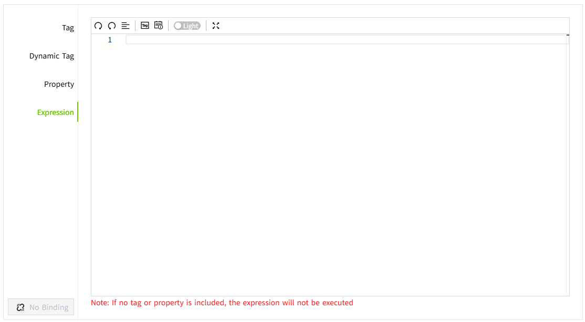
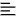
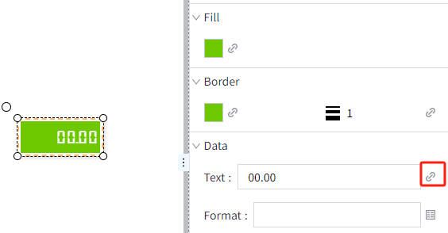
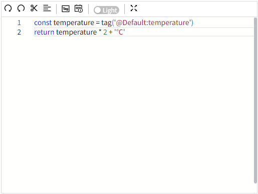
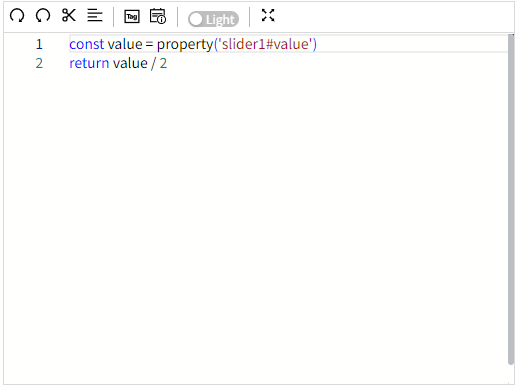

# Expression

Value binding is achieved by writing scripts in the script editor.

**Toolbar**

| **Icon** | **Description** |
|-----------|----------------|
|  | Redo, re-execute the canceled operation, and restore the text to the state before "undo" |
|  | Undo, cancel the latest editing operation and restore the text to its previous state     |
|  | Format document |
| | Select a tag and a tag selection window will pop up after clicking it.                   |
|  | Select the property, and the property selection window will pop up after clicking it.    |
| | Switch editor theme color                                                                |
| | Full-screen display                                                                      |

**Example 1**

Display real-time tag values and its unit on the LED Display.

1. Draw a LED Display on the page.
2. Set the fill color and border color of the LED Display to 6ec800 and the font color to ffffff.
3. Click the binding button of "Text" on the LED Display.

    

4. Select the expression in the property binding window and write the following expression in the editor.

    

5. Click the preview button on the page to view the display effect.

    

**Example 2**

The value of the LED Display is half of the value of the slider.

1. Draw a LED Display and a Slider on the page.
2. Set the fill color and border color of the LED Display to 6ec800 and the font color to ffffff.
3. Click the binding button of "Text" on the LED Display.

    

4. Select the expression in the property binding window and write the following expression in the editor.

    

5. Click the preview button of the page, and on the preview page, manually drag the slider of the slider to change its value and check the display effect of the LED Display. The value of the LED Display is half of the value of the slider.

    

**Example 3**

Based on the motor name selected from the drop-down box, display the corresponding motor's speed.

1. Draw a value display control and a dropdown control on the page.
2. The dropdown options of the drop-down box have three values: Motor1, Motor2, and Motor3.
3. Click the "Text" binding button of the value display control. 

    

4. Write the following expression in the property binding window.

    

5. Click the preview button , then on the running page, select the motor name from the drop-down box, and the corresponding motor speed will be displayed.

    

