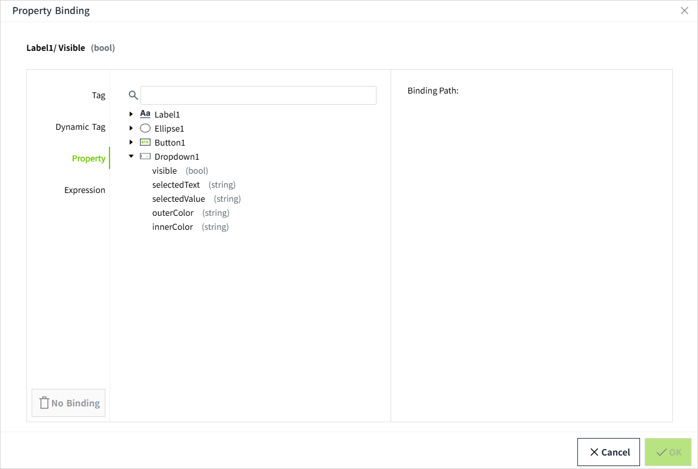

# Property Binding

Binding is linking a control's property to another control.

## Binding types

- **Tag**: Directly bind to the tag property (usually a value), so that every time the selected tag property changes, the new value is pushed to the bound property.

    

- **Dynamic Tag**: It is very similar to tag binding, with the key difference being that you can introduce any number of parameters to dynamically construct the tag path at runtime, instead of directly binding to the tag's path. These parameters are represented with curly braces, such as {1}. Once these parameters are replaced with the text values they are bound to, the binding will link to the tag indicated by the constructed tag path.

    

- **Property**: Bind a property to a custom property of the current page or to one of the properties of a control within the current page. When the bound property changes, the new value will be pushed to the property that is set with the binding.

    

- **Expression**: Use simple expressions to perform calculations on values that may involve large amounts of dynamic data.

    

- **Dynamic Cell**: Bind a cell within a datatable to a tag or property. This allows one or more cells in the datatable to be easily made dynamic. It is commonly used in chart controls, such as bar chart.

    

- **SQL Query**： Binds the created SQL Query to the control, rendering the data queried from the database on the control. Often used for table controls, such as tables.

    

## Set Property Binding

Every control placed on the page has various properties that change the appearance and behavior of the control. To make a control perform useful actions, such as displaying dynamic information or controlling a device, configure bindings on the control. Bindings let you bring your controls to life and let them perform useful actions. In the property editor, a binding icon will be displayed behind a bindable property. To bind a property, just click the binding icon to the right of the property.

When the property is not bound, the icon is gray.

After binding, the icon turns green.

You can quickly distinguish which properties have binding set by the color of the binding icon.

Summarized as follows:

- The number type can only bind number type attributes;
- The bool type can only bind properties of the bool type;
- The string type can bind attributes of all types (number, bool, string).

## Copy Binding

When you copy a control, all property bindings, scripts, etc. are copied with it.

