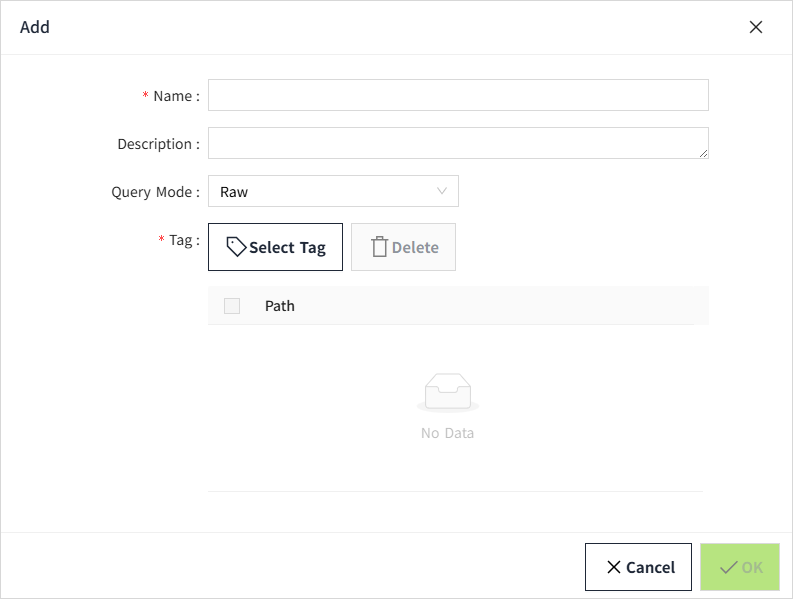

# Create Data Source

Data connection is the first step before any data analysis. The built-in report designer of VC Hub seamlessly integrates with VC Hub's historical database as well as enterprise SQL databases such as MySQL, SQL Server, Oracle, etc. This chapter will provide detailed instructions on how to use VC Hub's historical tags as data sources for reports.

1. Double click the mouse on the report and open the design window.
2. In the design pop-up window, click the "Add" button in the upper right corner of the data source list.

3. On the new page, keep all default values and enter the following information in the following fields (Note: The following data are only examples, please fill in according to the actual situation).

Name: Capacity

Query Mode: Raw

Tag: Region: Capacity.Production Line 1, Region: Capacity. Production Line 2, Region: Capacity. Production Line 3, Region: Capacity. Production Line 4, Region: Capacity. Production Line 5, Region: Capacity. Production Line 6

4. Click the **"** **OK** **" **button. At this time, the data will be displayed on the data source list page.

**Configuration**

| **Name**    | **Description**  |
|-------------|------------------|
| Name        | The name of the data source.   |
| Description | Description of the data source.   |
| Query Mode  | Pull down to select the query mode, including: Raw，Fixed Points，Periodic.  When selecting the **Fixed Points**, the **Aggregation Mode** and **Points** must be set.        When selecting the **Periodic**, the **Aggregation Mode** and **Period** must be set.    |
| Tag         | Set the tags required for the data source. Multiple selections are allowed.   **Note:** Only tags with "history" turned on can be selected. |

5. Switch to the "Report Designer" page and click the Settings button.

6. The created data source information is automatically displayed in the report designer's data sources and datasets.

**Note:**
1. The dataset contains only 3 fields:  
- path 
- time 
- value 
2. When the data source is automatically created, two parameters are automatically created for each data source: start date and end date. The end date defaults to **today**; the start date is **(current date - 7 days)**. 
 

