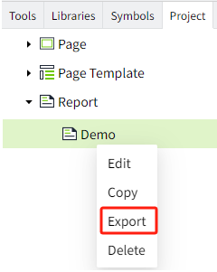

# Export/Import Reports

You can use the export and import functions of reports to implement operations such as data backup, recovery, sharing, and migration. You can export a single report or all reports in a report tree.

## Export

**Export all reports: **Right-click the root node of the report and click Export.

**Export a single report: **Right-click the mouse on a single report and click Export.

**Note:**  
- The exported report file will be automatically stored in the "Download" directory of your computer. 
- When exporting multiple reports, each report appears as a separate zip file. 

## Import

You can only right-click the root node of the report and click Import to complete the import operation.

**Note:** Because the report involves tag information, in order to ensure that the report can run normally after being imported into a new project or project, the tag data must also be imported, and the tag paths must be completely consistent.

**Example**

Import reports from workspace A to workspace B.

1. Export a report under the report node of workspace A: daily production capacity.

2. In the assets window, export the tags used in the report. Select the asset to which the tag in the report belongs and click the "Export" button. For example: the asset to which the tag used in the report belongs is: Default.

3. Open workspace B in the workspace list, right-click the mouse under the report node of workspace B, and click Import to import the report in step 1.
4. Import the tags used in the report into workspace B, and keep the tag paths consistent.

- Create a new asset in the asset list of workspace B named ”Production Line 1”.

- Select "Production Line 1" in the asset window and click the Import button to import the data in step 2.

5. View the imported report in the report viewer and the report can be displayed successfully.

