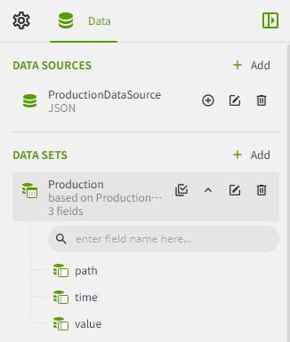

# Report

A report is a document that displays data in the form of tables, charts, etc. VC Hub has a built-in flexible and efficient report designer, including images, graphics, tables and other tools, which can be dragged and dropped way to quickly design various types of reports.

You can right-click the report node in the "Project" window and click "Add" to create it.

Some common application scenarios of reports in industry are as follows:

- Production efficiency monitoring: Track and analyze the efficiency indicators of the production line, such as output, etc.
- Quality control: Record and analyze product quality-related data, such as defective rate, etc.
- Equipment maintenance: record and analyze equipment maintenance status, such as downtime, etc.
- Inventory tracking: Monitor and optimize inventory status of materials and parts. For example:
- Energy consumption analysis: record and analyze energy consumption, such as electricity, water, gas, etc.
- Cost analysis: Analyze and manage the costs of the production process, such as labor costs, raw material costs, etc.

The following flowchart can help you quickly understand the usage process of reports, and we hope it can be helpful to you.

## Data source automatically created

After you create a data source in a report and open the report designer, all data sources for the report are automatically added to the report designer.

**Created Data Source:**

**Data sources displayed in the report designer:**

## Powerful report designer

The report designer provides the ability to develop multiple report styles, and helps users easily design multiple report styles through built-in rich report controls, such as tables, matrix tables, charts and other controls.

## Standalone report viewer

You can view the designed report in the Report Viewer .

## Supports multiple file formats

In the report viewer, click the "Export" button to select the file format you want to export.

Supported file formats are as follows:

- Excel(*.xlsx)
- Word(*.docx)
- PDF(*.pdf)
- CSV(*.csv)
- JSON(*.json)
- XML(*.xml)
- Image(*.tiff)
- WEB email files (*.mht)

