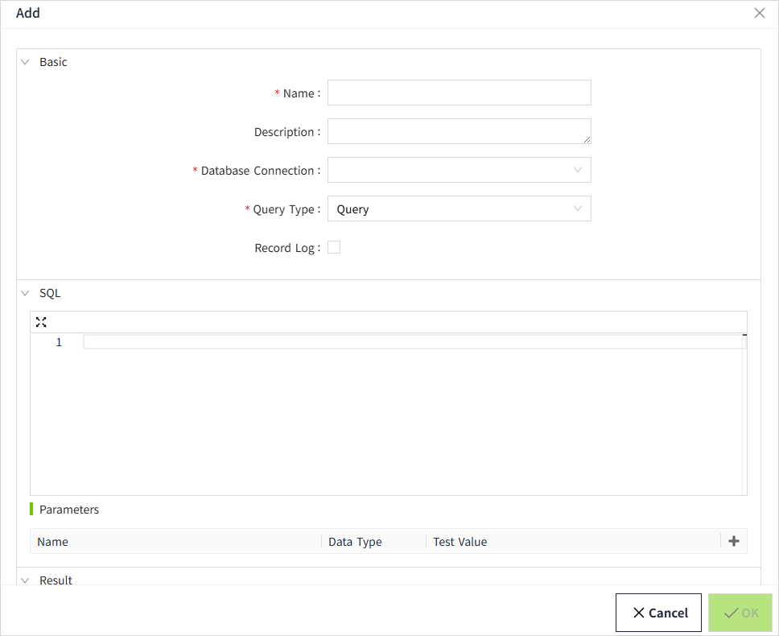
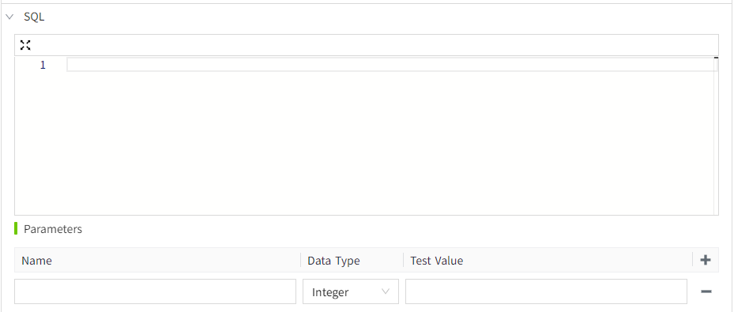
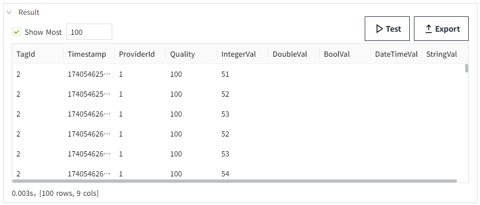

# Create SQL Query

To create an SQL Query, right-click the "SQL Query" node and select "Add".

**Note**： In use, SQL Query is referred to by name, so all references to the SQL Query need to be updated when renaming. 
## Basic

| **Name**            | **Description**  |
|---------------------|----------|
| Name                | The name of the SQL Query, which must be unique.|
| Description         | Description of the SQL Query. |
| Database Connection | The dropdown displays database connections that are in the "Connected" state, allowing the user to select one. During database connection verification, only the currently selected database will be validated, without verifying its backup database.|
| Query Type          | Query types include **Query**,  **Scalar Query**，**Update Query**.  When **Scalar Query** is selected, the fallback value can be set. A fallback value is returned when the query fails.   |
| Record Log          | Enable/Disable log recording|

## SQL 

| **Name**   | **Description** |
|------------|---|
| SQL Editor | Write the SQL Query statement in the editor. Based on the database selected in Basic Information, use the corresponding SQL statement. |
| Parameters | Click the + button on the far right of the parameters list to add the parameters. They act as placeholders for which you can pass concrete values when executing a query.  Each parameter contains three properties:   - Name: The name of the parameter. After SQL Query, you only need to modify the value of the parameter to make the SQL statement execute according to different conditions.  - Data Type: The data type of the parameter.  - Test Value: This value is used as a parameter value during the result test to test the query.   Note: In SQL statements, the @ symbol is prefixed to the parameter, and the parameter can only be used in a where statement.    **Note**: When the data type is DateTime, the test value will include a UTC option, which is only applicable to PostgreSQL databases. |

## Result

Once the SQL Query is written, it can be tested directly on the current page without binding it to a control.

Click the **Test** button to execute the query.

| **Name**  | **Description**|
|-----------|--------------|
| Show Most | When enabled, allows you to set the maximum number of rows that a Query will return when testing an SQL Query. This property can be enabled only if the Query type is set to **Query**. |
| Test      | Tests that SQLQuery executes correctly and displays the query results in the results area. |
| Export    | Export SQL Query results to CSV files. The exported content is what is displayed in the result.  |

