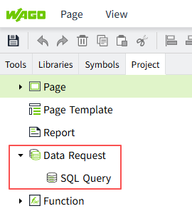
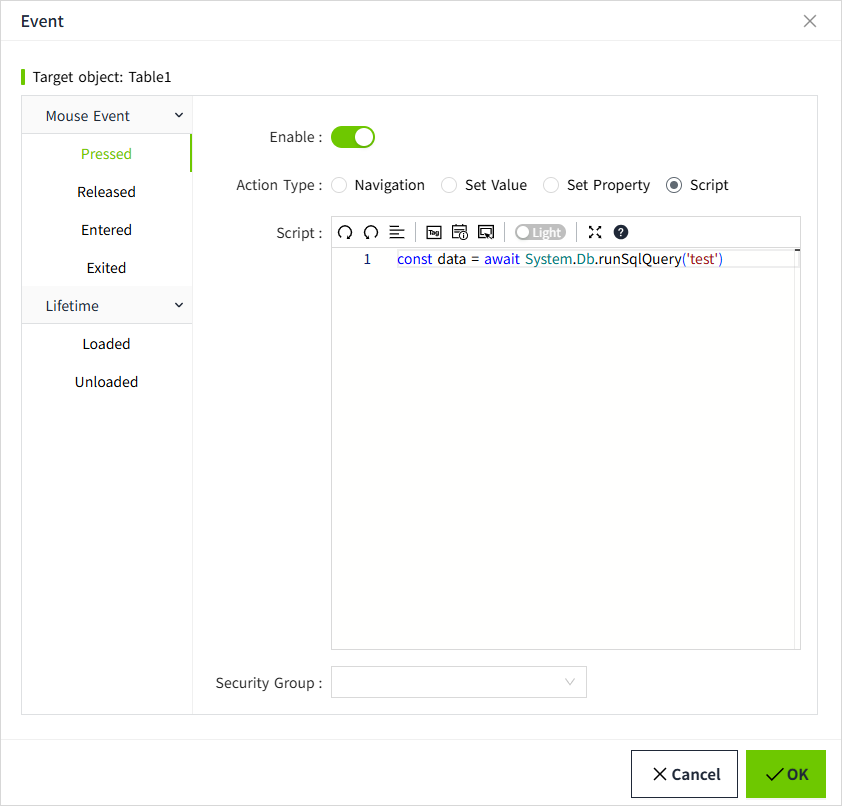

# SQL Query

## What is SQL Query?

SQL Queries are pre-created queries that can be called from multiple places in your project. When you execute an SQL Query, you can pass parameters to get a dynamic result set, avoiding repeating the query code.

There are three types of SQL Query:

1. **Query**：This is the most common type of query and is typically used to retrieve data from a database, execute a SELECT statement and return the complete result set. This type should be selected when running SELECT statements that return multiple rows or columns.
2. **Scalar Query**：Used to return a single value, not multiple rows and columns, but a single value for the first row of the first column. This type is special because you can define Fallback values. If there is an error, the Fallback value will be returned.
3. **Update Query**：Used to modify existing data in the database. You can specify the tables and fields to update by passing arguments, and update the matching rows based on conditions such as WHERE clauses. This query does not return data, but directly affects the database contents.

The SQL Query is located under "Project" > "Data Request" in the 2D editor.

## Where to use SQL Query?

SQL Query can be used in several places. Here are some examples where SQL queries can be used.

1. Property binding. At present, only the Table control supports binding SQL Query. 
    
    You can bind an created SQL Query. The result of a query can be displayed on the table control as the data set of the table.
    
2. Script
    Function **"System.Db.runSqlQuery"** can be used to call SQL Query from any script.
    

