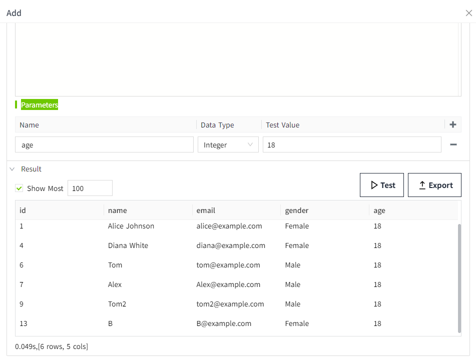

# Query

## Example

According to the age entered by the user, the corresponding person is queried in the database, and the query result is displayed through the table.

## Steps

#### Creating a database connection

On the "Databases"->"Database Connection" page, create a new database connection named **TestSQLQuery**.


There is a table named `person_management` in the database, which is used to store personnel information. Its structure is as follows:

| Id | name          | email               | gender | age |
|----|---------------|---------------------|--------|-----|
| 1  | Alice Johnson | `alice@example.com`  | Female | 18  |
| 2  | Bob Smith     | `bob@example.com`     | Male   | 19  |
| 3  | Charlie Brown | `charlie@example.com` | Male   | 19  |
| 4  | Diana White   | `diana@example.com`   | Female | 18  |
| 5  | Edward Green  | `edward@example.com`  | Female | 20  |

#### Create SQL Query

1. Create the project, click the  **Design** button in the action bar to enter the editor.
2. Create an SQL Query by right-clicking on the SQL Query node in the 2D editor and selecting **Add** button.
    
3. In this example, we set the name of this SQL Query to **Query**.
    
    **Database Connection:** Select an item whose status is "Connected "in the "Databases" ->"Database Connection" list. Here we select the **TestSQLQuery** already created in Step 1.
    **Query Type:** Select **Query**.
    **SQL Editor:** Write the following query that searches the `person_management` table against the value of age. Where  @age denotes the parameter.
    ```sql
    SELECT * FROM person_management WHERE age = @age;
    ```
    **Parameters:** Create a parameter called age. Acts as a placeholder in an SQL statement to which you can pass concrete values when executing a query.
4. Click the "Test" button to see the results.
    

#### **Use Query**

1. Find the '**Table**' control in the **Tools** window of the 2D design page and drag it to the page.
    
2. Select the table control, in the property bar, click the binding button of the "Table" property, and bind an SQL Query for it.
    
3. After selecting **SQL Query**, choose the newly created query **"Query"** from the **Name** dropdown list.
    
4. Click the bind button for the parameter "age".
    
    The property binding window pops up and binds it to the value property of **NumberInput1**. When NumberInput1 enters different values, the query is performed according to different ages.
    
5. Transform allow you to add, modify, or remove columns from the query again.
    When the Test button is clicked, the result is as follows:
    
    If we want to hide the **id** column, we can write the following script in the transformation.
    ```typescript
    function transform(data: Table){
        data.forEach(res=>{
            delete res.id
        })
        return data;
    };
    ```
6. Click the Test button again.In the results list, the **id** column is no longer displayed.
    
7. Finally, we want to make sure that polling mode is set to off. This means that the query will not run continuously, but only when the parameters change, such as when a new value is entered inside NumberInput1.
    
8. Click the "OK" button to finish binding, and click the preview of the page for testing. Enter the age to query in the " NumberInput1" of the preview screen to retrieve the matching data and display the query results in the table.
    

