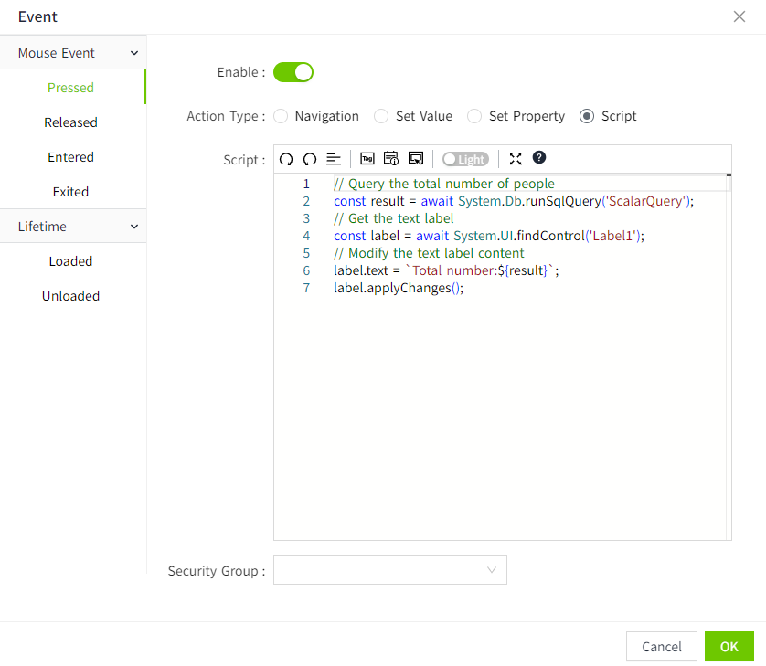

# Scalar Query

## Example

Query the total number of people in the database, and display the query results on the screen.

## Steps

#### Creating a database connection

On the "Databases"->"Database Connection" page, create a new database connection named **TestSQLQuery**. 


There is a table named `person_management` in the database, which is used to store personnel information. Its structure is as follows:

| Id | name          | email               | gender | age |
|----|---------------|---------------------|--------|-----|
| 1  | Alice Johnson | `alice@example.com`   | Female | 18  |
| 2  | Bob Smith     | `bob@example.com`     | Male   | 19  |
| 3  | Charlie Brown | `charlie@example.com` | Male   | 19  |
| 4  | Diana White   | `diana@example.com`   | Female | 18  |
| 5  | Edward Green  | `edward@example.com`  | Female | 20  |

#### Create SQL Query

1. Create the project, click the  **Design** button in the action bar to enter the 2D editor.
2. Create an SQL Query by right-clicking on the SQL Query node in the 2D editor and selecting **Add** button.


3. In this example, we set the name of this SQL Query to **ScalarQuery**。


**Database Connection:** Select an item whose status is "Connected "in the "Databases" ->"Database Connection" list. Here we select the **TestSQLQuery** already created in Step 1.

**Query Type:** In this case, the result of the execution returns a value, so we choose **Scalar Query**。

**Fallback Value:** Data returned if the SQL statement fails.

**SQL Editor:** Write the following query to find the total number of people in the `person_management` table.

```sql
SELECT COUNT(*) FROM person_management;
```
 
4. Click the "Test" button to see the results.


## **Use Scalar Query**

1. Find '**Label**' and '**Button**' controls in the Tools window of the design page and drag them to the page.


2. Select the button control and click the icon pointed by the arrow to open the configuration page of the action.


3. Configure the **mouse pressed** event for the button, query the total number of people each time the button is clicked, and display the result in the Label control.



```typescript
// Query the total number of people
const result = await System.Db.runSqlQuery('ScalarQuery');
// Get the text label
const label = await System.UI.findControl('Label1');
// Modify the text label content
label.text = `Total number:${result}`;
label.applyChanges();
```
 
4. Click the preview button on the page, and press the button on the preview page to query the total number of people.

