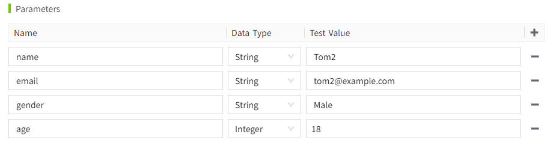
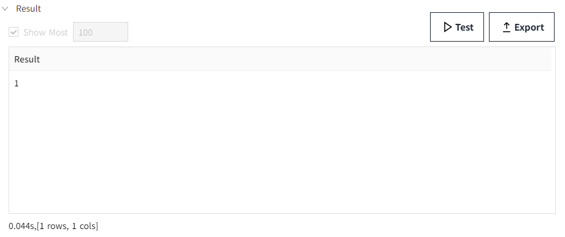
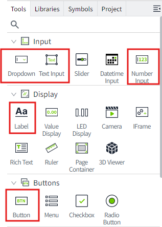
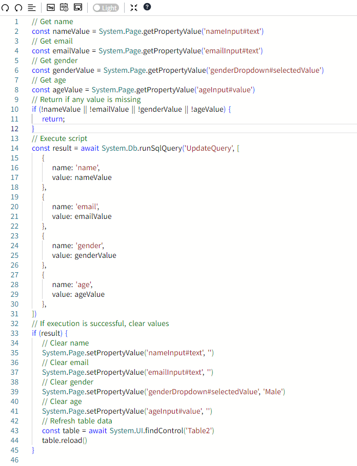

# Update Query

## Example

Add new data to the database.

## Steps

#### Creating a database connection

On the "Databases"->"Database Connection" page, create a new database connection named **TestSQLQuery**. 


There is a table named `person_management` in the database, which is used to store personnel information. Its structure is as follows:

| Id | name          | email               | gender | age |
|----|---------------|---------------------|--------|-----|
| 1  | Alice Johnson | `alice@example.com`   | Female | 18  |
| 2  | Bob Smith     | `bob@example.com`     | Male   | 19  |
| 3  | Charlie Brown | `charlie@example.com` | Male   | 19  |
| 4  | Diana White   | `diana@example.com`   | Female | 18  |
| 5  | Edward Green  | `edward@example.com`  | Female | 20  |

#### Create SQL Query

1. Create the project, click the **Design** button in the action bar to enter the editor.
2. Create an SQL Query by right-clicking on the SQL Query node in the 2D editor and selecting **Add** button.


3. In this example, we set the name of this SQL Query to **UpdateQuery**.


**Database Connection:** Select an item whose status is "Connected "in the "Databases" ->"Database Connection" list. Here we select the **TestSQLQuery** already created in Step 1.

**Query Type:** In this example, we want to update the table data, so we choose **Scalar Query **.

**SQL Editor:** Write the following SQL statement that adds a new row to the`person_management` table with a parameter.

```sql
INSERT INTO person_management (name, email, gender, age) 
VALUES (@name, @email, @gender, @age);
```
 
**Parameters:** Create a parameter called age. Acts as a placeholder in an SQL statement to which you can pass concrete values when executing a query.



4. Click the "Test" button.You can see that Result returns the data 1, which means that the execution was successful, affecting a row of data.

   **Note**：Executing statements of type '**Update Query**' via the test button will also actually modify the database contents. 

   

#### Use Update Query

1. In the Design Page **Tools** window, add 4 Label, 2 Text input, 1 DropDown, 1 NumberInput, and 1 Button to the page.



Compose a simple Add data page as follows.


2. Select the button control and click the icon pointed by the arrow to open the configuration page of the action.


3. Configure the **mouse pressed** event for the button.Each time the button is clicked, get the values for the input and drop-down fields, and add the values to the database.



```typescript
// Get name
const nameValue = System.Page.getPropertyValue('nameInput#text')
// Get email
const emailValue = System.Page.getPropertyValue('emailInput#text')
// Get gender
const genderValue = System.Page.getPropertyValue('genderDropdown#selectedValue')
// Get age
const ageValue = System.Page.getPropertyValue('ageInput#value')
// Return if any value is missing
if (!nameValue || !emailValue || !genderValue || !ageValue) {
    return;
}

// Execute script
const result = await System.Db.runSqlQuery('UpdateQuery', [
    {
        name: 'name',
        value: nameValue
    },
    {
        name: 'email',
        value: emailValue
    },
    {
        name: 'gender',
        value: genderValue
    },
    {
        name: 'age',
        value: ageValue
    },
])
// If execution is successful, clear values
if (result) {
    // Clear name
    System.Page.setPropertyValue('nameInput#text', '')
    // Clear email
    System.Page.setPropertyValue('emailInput#text', '')
    // Clear gender
    System.Page.setPropertyValue('genderDropdown#selectedValue', 'Male')
    // Clear age
    System.Page.setPropertyValue('ageInput#value', '')
    // Refresh table data
    const table = await System.UI.findControl('Table2')
    table.reload()
}

```
 
4. Click the preview button on the page, and press the button on the preview page to add data to the database. When the new data is added, the table is reloaded and the new data is displayed.


