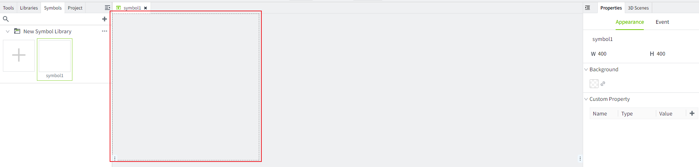
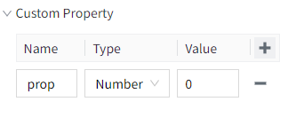
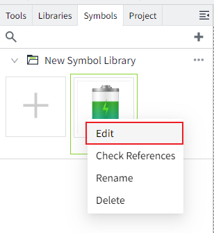
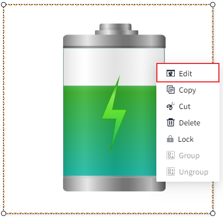
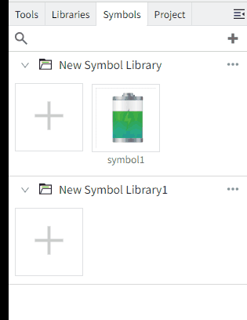

# Create Symbol

You can create symbols in the "Symbol" editor. Once created, a symbol can be used as a template and then instantiated multiple times across different screens. Each instance will have the same components and properties, but the data can vary. Any changes made to the template will automatically update across all symbol instances.

## Add Symbol

You can expand any symbol library, click the ➕ within the library, and a new window will pop up. Set the name of the symbol and click the "OK" button to create the symbol.

After creation, an empty symbol editor will be displayed in the main design space. The initial symbol editor is completely transparent. You can set a background if you want.

**Properties**

| **Name**        | **Description**   |
|-----------------|-----------|
| W               | Width of the symbol. |
| H               | Height of the symbol.   |
| Background      | Background color of the symbol, supports property binding    |
| Custom Property | You can use custom properties like any other properties, such as for data binding, scripts, and styles. To configure custom properties, follow these steps:   1. Click on the blank area of the symbol editor.  2. Go to "Appearance" > "Custom Property."  3. Click the plus (+) icon to add a row.  4. Enter the custom property name, data type, and initial value.  5. The custom property is automatically saved after you add it.    |

**Note:** Symbols support nesting, allowing one symbol to be embedded within another. However, a symbol cannot be nested within itself.

**How to view the properties of the Symbol Editor window**

1. Click on a blank area of the symbol editor
2. Click on its tab name

3. click the gray area outside the canvas (the area highlighted in the red box below).

## Edit Symbol

Just like drawing a screen, you can add components (e.g., controls, images, symbols) in the symbol window. Once a symbol is modified, all instances of that symbol will be updated.

When your symbol creation is complete, you can open the symbol for editing using the following four methods:

1. Double-click the symbol in the "Symbol Library" to automatically open the symbol's editing window in the editor.
2. Right-click the symbol and select "Edit" from the context menu that appears.

2. In the editor, double-click the symbol component to open the symbol for editing.
3. In the editor, right-click the selected symbol component and choose the "Edit" button from the context menu to open the symbol.

## Save As Symbol

After creating the symbol, click the "Save As" button in the Page menu. Set the desired symbol library and symbol name to complete the creation.

## Move Symbol

You can change the symbol's associated symbol library by dragging and dropping. To move a symbol to another library, click on the symbol and drag the mouse to the target library, then release the mouse to drop it.

**Note:** If the symbol is currently open, you cannot perform the operation of moving the symbol. 

## Copy/Paste Symbol

Right-click on a symbol in the symbol library and select the "Copy" option to duplicate the symbol.

After copying, click the "..." in the symbol library to paste the symbol.

## Instance Symbol

Once the symbol is created, you can drag the symbol onto the screen or screen template to create multiple instances of the symbol. After the instances are created, you can manipulate their properties just like any other control.

**Properties of the Symbol Instance**

| **Name**        | **Description**                                                                                                                  |
|-----------------|----------------------------------------------------------------------------------------------------------------------------------|
| Name            | Name of this symbol instance.                                                                                                    |
| X               | The distance from the left side of the canvas to the left side of the symbol instance.                                           |
| Y               | The distance from the top of the canvas to the top of the symbol instance.                                                       |
| W               | The width of the symbol instance.                                                                                                |
| H               | The height of the symbol instance.                                                                                               |
| Path            | The complete path of the symbol instance.                                                                                        |
| Custom Property | These are consistent with the custom properties set for the symbol. You can click the bind button to configure the property binding. |