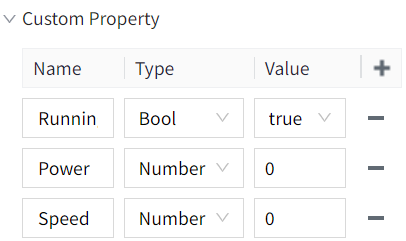
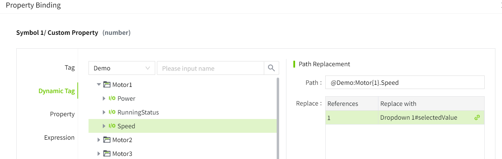
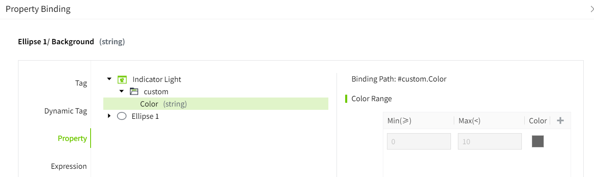

# How to use symbol

## Example 1: Using Indirect Tag Binding for Multiple Motors

**Scenario:**
Assume there are three motors with the same configuration, each having three tags: "Running Status" ,"Power", and "Speed". We want to use a single symbol to display the status of these motors. Indirect tag binding can help us achieve this goal.

Tag paths：

@Region:Motor1.RunningStatus

@Region:Motor1.Power

@Region:Motor1.Speed

@Region:Motor2.RunningStatus

@Region:Motor2.Power

@Region:Motor2.Speed

@Region:Motor3.RunningStatus

@Region:Motor3.Power

@Region:Motor3.Speed

1. In the Symbol window, create an symbol  library: Library 1.
2. Click on the Add button of this library to add a symbol named “Motor”.
3. Add a picture of the motor in the symbol editing window; add three label controls, named : RunningStatus, Power, Speed; add three value display controls, placed behind the labels, for displaying the corresponding values. The drawing effect is as follows:

4. Click on a blank space in the symbol window to add the following custom properties.

5. In the symbol, bind the text property of the value display control after **RunningStatus** to the symbol's custom property: **RunningStatus**. 

Bind the text property of the value display control after **Power** to the symbol's custom property: **Power**. 

Bind the text property of the value display control after **Speed** to the symbol's custom property: **Speed**.

6. Add an instance of the motor on Page1, including a label and a dropdown. Set the text of the label to **"Motor:"**, and configure the dropdown list as follows:

7. On the page, click on the symbol instance to bind its properties so that it displays the corresponding motor parameters based on the selected value from the dropdown.

In its properties, click the **"RunningStatus"** binding button to bind it to the following dynamic tag.

In its properties, click the **"Power"** binding button to bind it to the following dynamic tag.

In its properties, click the **"Speed"** binding button to bind it to the following dynamic tag.

8. On the runnning page, switch the value of the dropdown to view the parameter values displayed on the symbol.

**Example 2:** Suppose you have a pump, and you want to use a symbol to display the pump's operating status. If the pump is running, the symbol displays as green; if the pump is stopped, the symbol displays as red.

1. In the **"Symbol"** window, create a symbol library called **Library 1**.
2. Click the **Add** button in the symbol library to add a symbol named **"Indicator Light."**
3. In the symbol editing window, add a ellipse to represent the pump's operating status indicator light.
4. Click on the blank area of the symbol to add a custom property named **Color**.

5. Click the **binding button** for the fill color of the ellipse and bind it to the symbol's custom property **Color**.

6. Add the symbol to the page, click on the symbol, and in its defined properties, click the **binding button** for the **Color** property to bind it to an expression. When the tag value is true, it should display green, and when the tag value is false, it should display red. 

      The tag **Demo:IndicatorLight** represents the device's indicator light status and is a bool type tag.

7. On the Running page, view the effect of the symbol.

