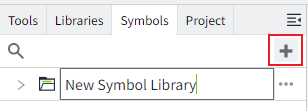

# Symbol Libraries

Manage symbols in the "Symbols" window.

## Add Symbol Library

Click the "Add" button on the right side of the symbol library to create a new symbol library. After clicking, a new symbol library will be automatically created with the default name: `New Symbol Library`.

After the new symbol library is successfully created, the library name will be in edit mode, allowing you to modify it. If you need to change it again, double-click the symbol library location to enter the name edit mode.

## Export Symbol Library

Click the `...` icon behind the symbol library. In the dropdown menu, click the "Export" button to export symbol files within that symbol library.

In the export window, you can manually select the symbols you wish to export.

## Import Symbol Library

Click the `...` icon behind the symbol library, and in the dropdown menu, click the "Import" button to import the previously exported files into the current symbol library.

## Delete Symbol Library

Click the `...` icon behind the symbol library, and in the dropdown menu, click the "Delete" button. This will delete all symbols within that library.

A confirmation message is displayed. Click the "OK" button to complete the deletion.

If a symbol from the library has been used, and the library is subsequently deleted, any pages that utilized symbols from that library will display a broken image icon on the runtime page, indicating that the content is missing.

