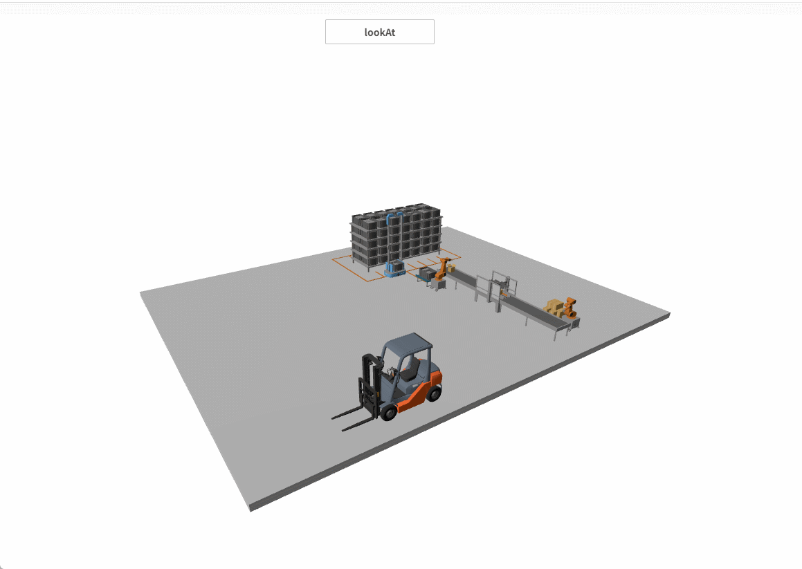
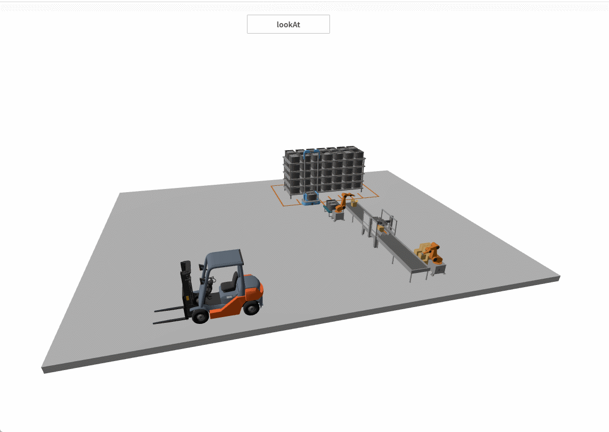

# lookAt

**Description:** The camera focuses on objects within the scene.

#### Usage Method 1:

```typescript
const view = await System.UI.findControl('3DViewer1')// Obtain a 3D viewer control named "3DViewer1" in the page
const scene = await view.getScene();
const mesh = await scene.findMesh({ name: 'Forklift' });
await scene.camera.lookAt({
    object: mesh,
    distance: 1, // The distance between the camera and the model.
    duration: 500 // Animation duration.
});
```
 
**Example:**

Write the above code on a button so that when the button is clicked, the camera focuses on the model from any position in the scene.



#### Usage Method 2:

```typescript
const view = await System.UI.findControl('3DViewer1')// Obtain a 3D viewer control named "3DViewer1" in the page
const scene = await view.getScene();
const mesh = await scene.findMesh({ name: 'Forklift' });
await scene.camera.lookAt({
    object: mesh,
    viewOffset: { x: 0, y: 30, z: 0 }, // Camera position after the animation ends.
    duration: 500 // Animation duration.
});
```
 
**Example:**

Write the above code on a button so that when the button is clicked, the camera focuses on the model and remains in a fixed position.




