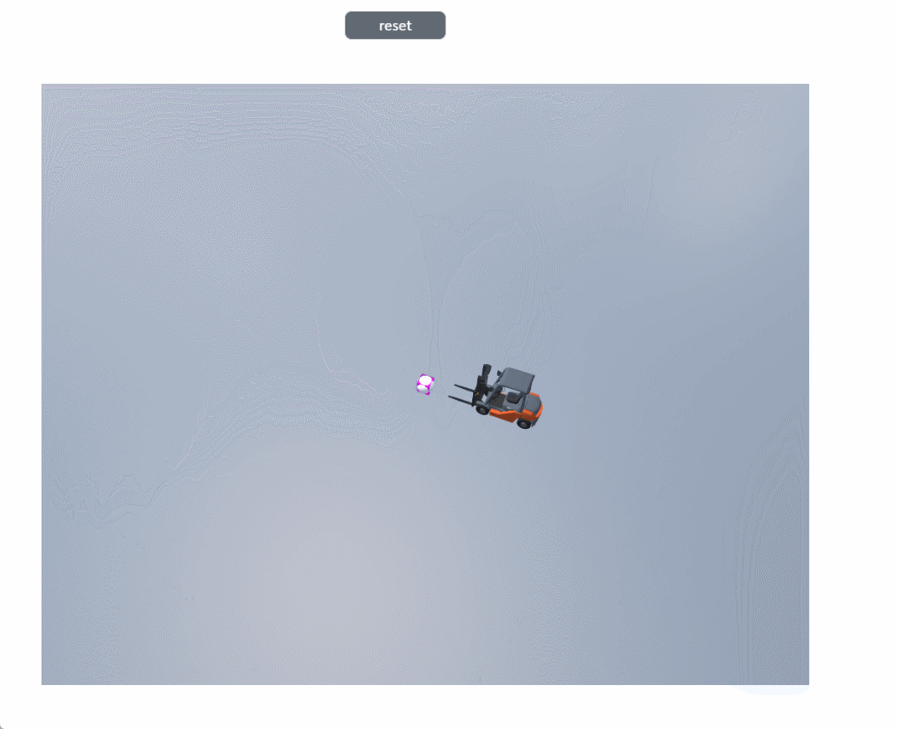

# reset

**Description: Reset camera settings, stop camera animation, and return to the initial position**

```typescript
const view = await System.UI.findControl('3DViewer1')// Obtain a 3D viewer control named "3DViewer1" in the page
const scene = await view.getScene();
await scene.camera.reset();//Return the camera position to its initial position
```
 
**Example:**

Write the above code on the button, click the button, and the camera will return to its initial position.



