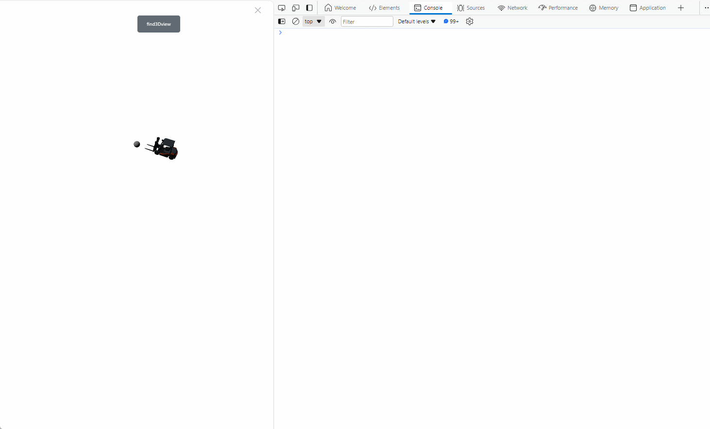
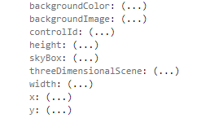

# find 3DView

**Description:** Obtain a 3D viewer from the page

```typescript
const view = await System.UI.findControl('3DViewer1'); // Obtain a 3D viewer control named "3DViewer1" in the page
console.log(view); // The 3D viewer control found in the console output query
```
 
**Example:**

Write the above code on the button, click the button, and you can see the properties and methods of the 3D scene in the console.






Tips: Viewing API parameter information


