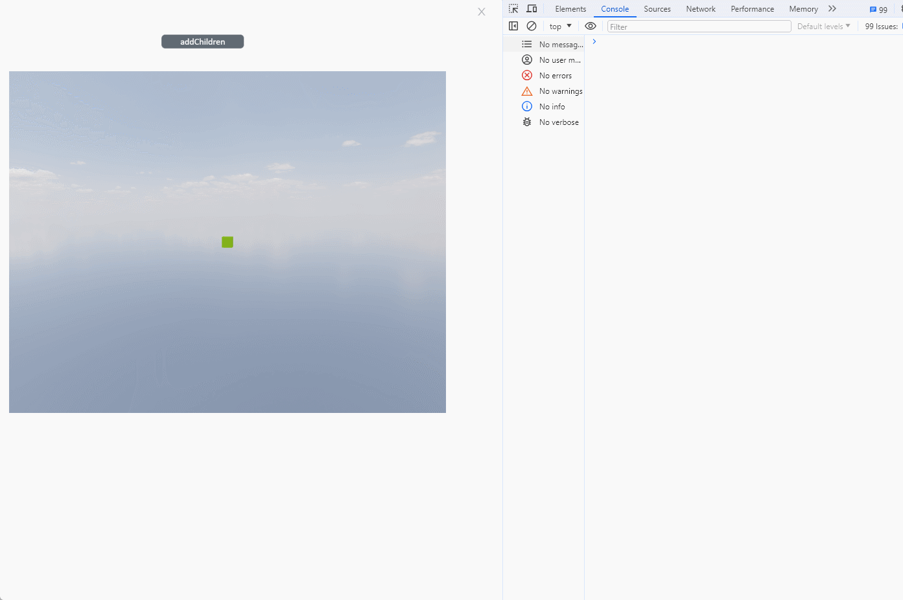

# addChildren

Description: Add children to the model

```typescript
const view = await System.UI.findControl('3DViewer1')// Obtain a 3D viewer control named "3DViewer1" in the page
const scene = await view.getScene()// Get the scene in the 3D viewer control
const box = await scene.findMesh({name:'Box2'})// Find model
box.addChildren([scene.createBasicMesh({
  type: 'Box',//The address of the model in the model library
  name: 'Box'+Math.floor(Math.random()*101),//The name after creation
  color: '#6ec800',//The color created
  position: {x: 0, y: 0, z: 0},//The created position
  rotation: {x: 0, y: 0, z: 0},//Rotation angle during creation
  size: [30, 30, 30],
})])// Add child model array to box
console.log(box.getChildren())// Console output box's children
```
 
Example:

Write the above code on the button, click the button to add a child model array to the model.



