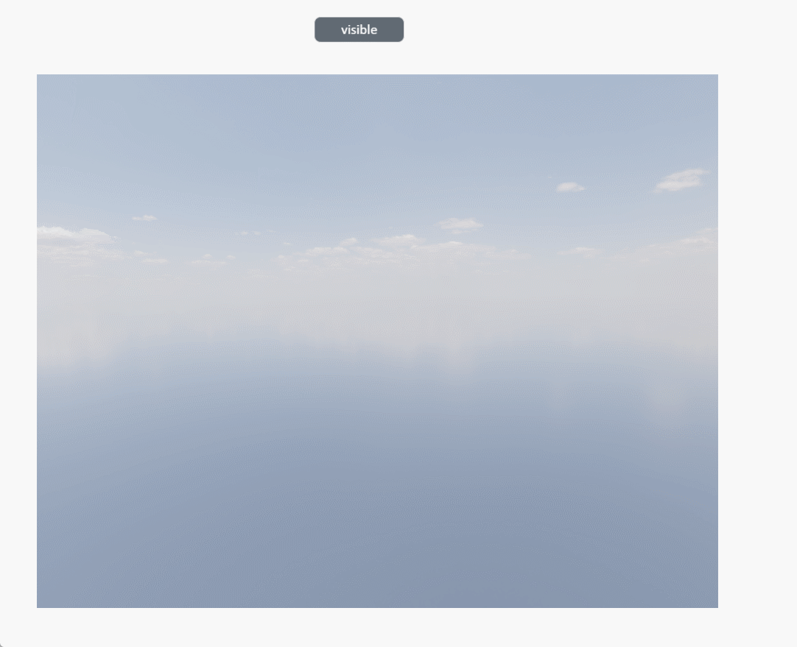

# visible

**Description: Set model visibility**

```typescript
const view = await System.UI.findControl('3DViewer1')// Obtain a 3D viewer control named "3DViewer1" in the page
const scene = await view.getScene()// Get the scene in the 3D viewer control
const box = scene.createBasicMesh({
  type: 'Box',//The address of the model in the model library
  name: 'Box2',//The name after creation
  color: '#6ec800',//The color created
  position: {x: 0, y: 0, z: 0},//The created position
  rotation: {x: 0, y: 0, z: 0},//Rotation angle during creation
  size: [30, 30, 30]
})// The initial length, width, and height of the created base model, Box default values [5,5,5], Sphere default values [3.5,15,15], Cylinder default values [2,2,15,20],

await setTimeout(()=>{
    box.visible = false;},1000) // Set box to hide after 1 secondto hide after 1 second
```
 
**Example:**

Write the above code on the button, click the button, and you can hide the created model. 



