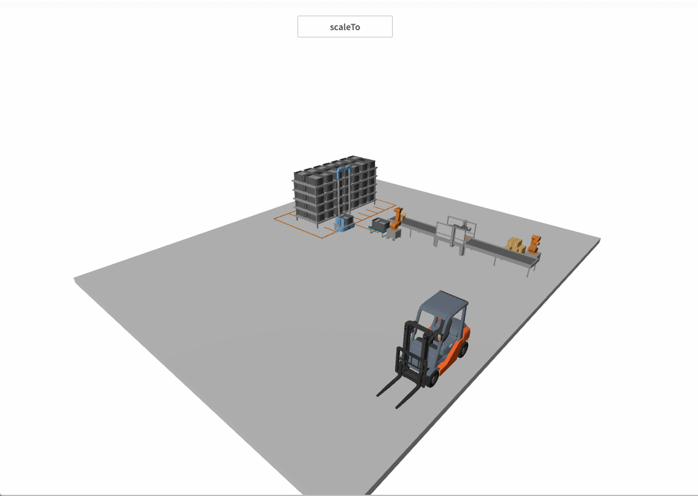

# scaleTo

**Description: Model rotation animation**

```typescript
const view = await System.UI.findControl('3DViewer1')// Obtain a 3D viewer control named "3DViewer1" in the page
const scene = await view.getScene()// Get the scene in the 3D viewer control
const mesh = await scene.findMesh({ name: 'Forklift' });
const meshScale = mesh.scale;
mesh.scaleTo({
    scale: { x: meshScale.x + 5, y: meshScale.y + 5, z: meshScale.z + 5 }, // Final scale value of the model.
    duration: 1000,             // Animation duration in milliseconds
    delay: 100,                 // Animation start delay in milliseconds
    executions: 1,              // Number of animation executions
    reversePlay: false,         // Whether to play in reverse
    resetOnComplete: false      // Whether to return to initial position after completion
});
```
 
**Example:**

Write the above code on a button. When the button is clicked, the model enlargement animation will play.


