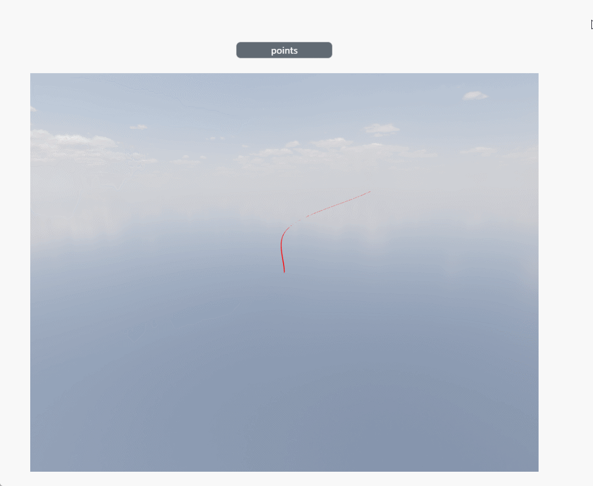

# points

**Description: Modify the vertex coordinates of texture lines**

```typescript
const view = await System.UI.findControl('3DViewer1')// Obtain a 3D viewer control named "3DViewer1" in the page
const scene = await view.getScene()// Get the scene in the 3D viewer control
const tube = await scene.findTube({name:'Tube1'})// Find model
tube.points = [{x: Math.floor(Math.random()*101), y: Math.floor(Math.random()*101), z: Math.floor(Math.random()*101)},
{x: Math.floor(Math.random()*101), y: Math.floor(Math.random()*101), z: Math.floor(Math.random()*101)},
{x: Math.floor(Math.random()*101), y: Math.floor(Math.random()*101), z: Math.floor(Math.random()*101)},
{x: Math.floor(Math.random()*101), y: Math.floor(Math.random()*101), z: Math.floor(Math.random()*101)},
{x: Math.floor(Math.random()*101), y: Math.floor(Math.random()*101), z: Math.floor(Math.random()*101)}]// Modify vertex coordinates
```
 
**Example:**

Write the above code on the button, click the button to modify the vertex coordinates of the texture line.



