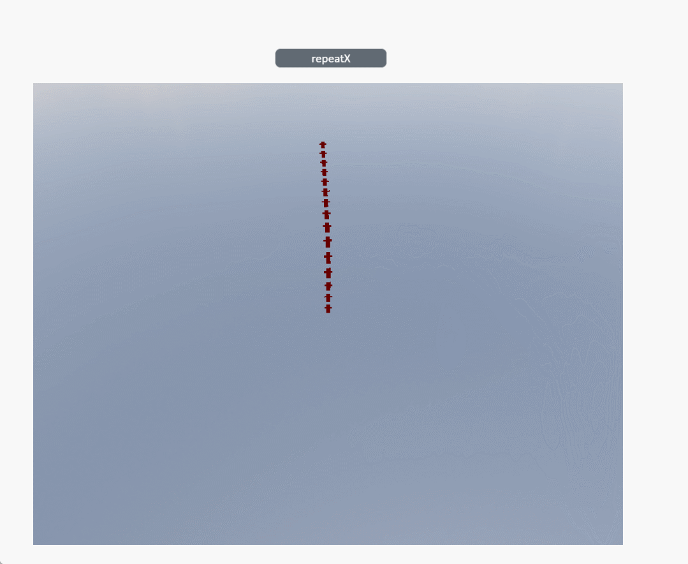

# repeatX

**Description: Modify the number of repetitions of texture line images in the x direction**

```typescript
const view = await System.UI.findControl('3DViewer1')// Obtain a 3D viewer control named "3DViewer1" in the page
const scene = await view.getScene()// Get the scene in the 3D viewer control
const tube = await scene.findTube({name:'Tube1'})// Find model
tube.repeatX = 5// Modify the number of repetitions of the image in the x direction
```
 
**Example:**

Write the above code on the button, click the button to modify the number of repetitions of the image in the x direction. 


