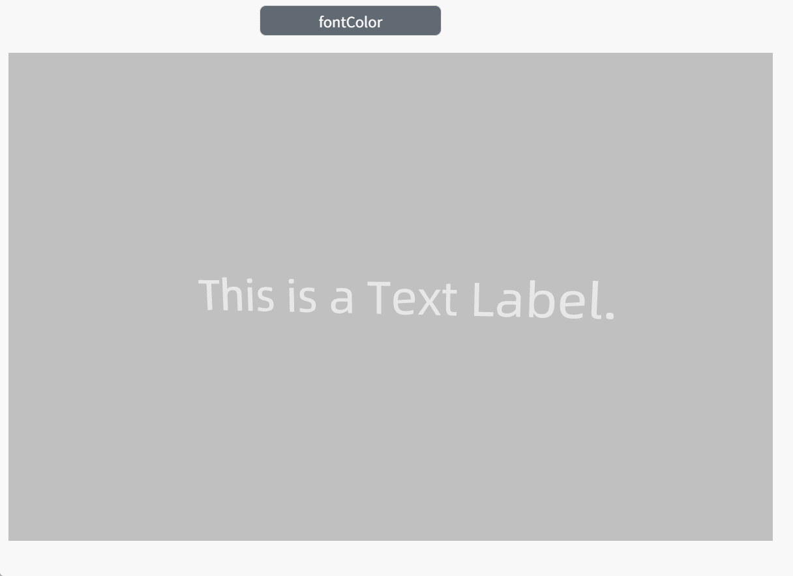

# fontColor

**Description: Modify text annotation color**

```typescript
const view = await System.UI.findControl('3DViewer1')// Obtain a 3D viewer control named "3DViewer1" in the page
const scene = await view.getScene()// Get the scene in the 3D viewer control
const label = await scene.findTextLabel({name:'Label1'})// Find model
label.fontColor = '#6ec800'// Modify text annotation color
```
 
**Example:**

Write the above code on the button, click the button to modify the text annotation color.

