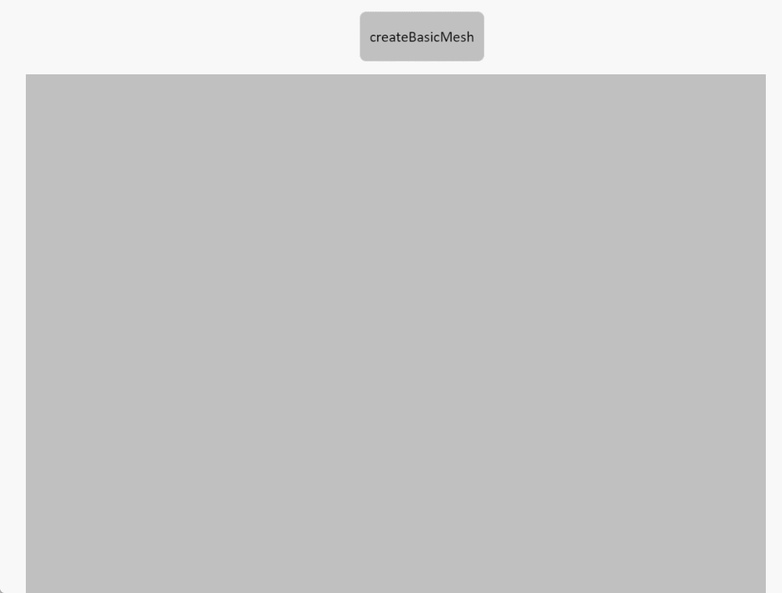

# createBasicMesh

**Description:** Create a basic model to enter the scene (including squares, circles, cylinders, torus)

```typescript
const view=await System.UI.findControl('3DViewer1');  // Obtain a 3D viewer control named "3DViewer1" in the page
const scene=await view.getScene()// Get the scene in the 3D viewer control
scene.createBasicMesh({
    type: 'Box',   // Model type: supports "Box" | "Sphere" | "Cylinder" | "Torus"
    name: 'Box',   // Model name
    color: '#6ec800',  // Model color (hex)
    position: { x: 0, y: 0, z: 0 }, // Initial position (default: 0,0,0)
    rotation: { x: 0, y: 0, z: 0 }, // Initial rotation (default: 0,0,0, unit: radians)
    size: [5, 5, 5] 
    // Model size parameters (varies by type)
    // Box      default [5, 5, 5]         => [width, height, depth]
    // Sphere   default [3.5, 15, 15]     => [radius, widthSegments, heightSegments]
    // Cylinder default [2, 2, 15, 20]    => [topRadius, bottomRadius, height, radialSegments]
    // Torus    default [5, 1.5, 16, 35]  => [radius, tube, radialSegments, tubularSegments]
});
```
 
**Example:**

Write the above code on the button, click the button to create a basic model to the scene





