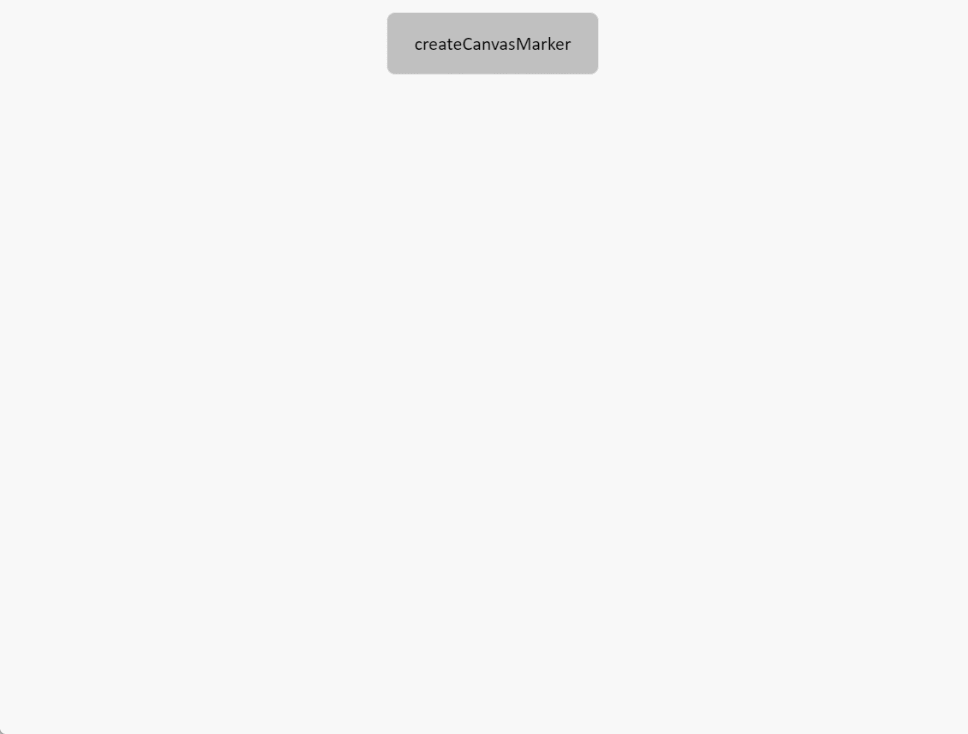

# createCanvasMarker

**Description**: Create image annotations that always face the camera through the incoming canvas

```typescript
const view = await System.UI.findControl('3DViewer1');  // Obtain a 3D viewer control named "3DViewer1" in the page
const scene = await view.getScene();
const canvas=document.createElement('canvas')// Create a canvas
const ctx = canvas.getContext('2d')// 2D rendering canvas
//Set canvas background
ctx.canvas.width=300;
ctx.canvas.height=100;
ctx.fillStyle='#808000';
ctx.fillRect(0, 0, 300, 100);
//Draw a brown rectangle with coordinates (0,0) in the upper left corner, a width of 300, and a height of 100
//Set Canvas Text
ctx.font='20px boldsans serif';
ctx.fillStyle='#ff0000';
ctx.fillText('This is a canvas', 0, 20)// Starting point coordinates 0, 20
scene.createCanvasMarker({
  canvas: canvas,//Select the canvas
  name: 'canvas',//Create the name of the image annotation
  position: {x: 0, y: 10, z: 0},//Create the position of the image annotation
  size: {width: 300, height: 100},//Create image annotations for length and width
  //Parent: ThreeDlElement | null//Create the parent of the object (added directly to the scene by default)
})
```
 
**Example:**

Write the above code on the button, click the button, and you can create an image annotation at the specified position



