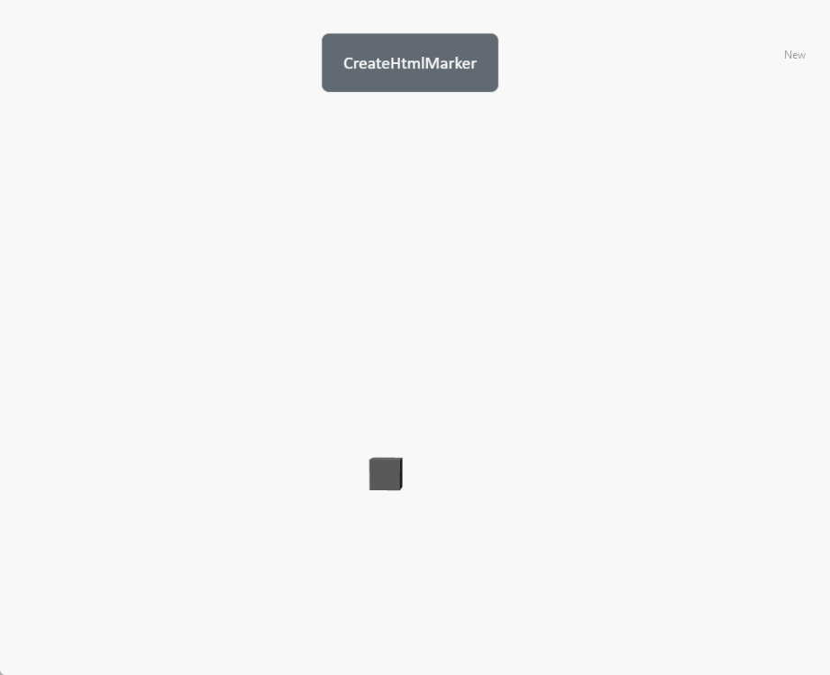

# createHtmlMarker

**Description:** Create annotations based on HTML

```typescript
const view=await System.UI.findControl('3DViewer1')// Obtain a 3D viewer control named "3DViewer1" in the page
const scene= await view.getScene();
let div = document.createElement('div')// Create a container for HTML elements
//Title
let head= document.createElement('p')// Create a paragraph to display the title
head.style.textAlign='center'// Align text center
head.style.padding='5px'// Text spacing
head.innerHTML='HtmlMarker'// Text content
div.appendChild(head)// Add title to container
const htmlMarker=scene.createHtmlMarker({
    element: div,//Select HTML annotation
    name: "HTML",//The name of the created HTML annotation
    fixed: true,//false: annotation always faces the lens true: fixed viewing angle faces the z-axis
    position: {x: 0, y: 10, z: 0},//The created position
    //Parent: ThreeDlElement | null//The created parent is added directly to the scene by default
});
```
 
**Example:**

Write the above code on the button, click the button, and you can create an HTML annotation at the specified location

