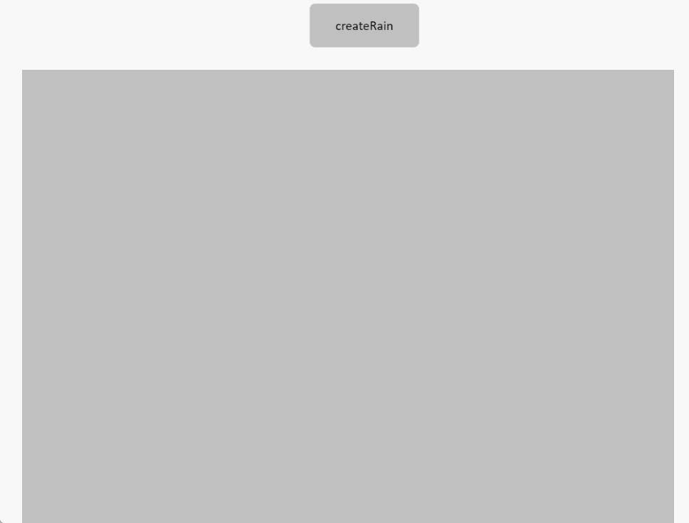
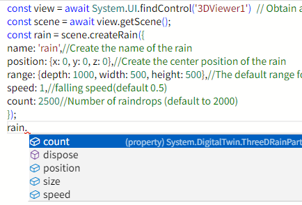

# createRain

**Description:** Create default rain effects

```typescript
const view = await System.UI.findControl('3DViewer1')// Obtain a 3D viewer control named "3DViewer1" in the page
const scene = await view.getScene();
const rain = scene.createRain({
name: 'rain',//Create the name of the rain
position: {x: 0, y: 0, z: 0},//Create the center position of the rain
range: {depth: 1000, width: 500, height: 500},//The default range for raindrops is (1000500500).the depth value is the range of depth/2 on the y-axis up and depth/2 on the y-axis down
speed: 1,//falling speed(default 0.5)
count: 2500//Number of raindrops (default to 2000)
});
```
 
**Example:**

Write the above code on the button, click the button, and you can create a rain special effect at the specified location




Modify rain effects and turn off effects:




