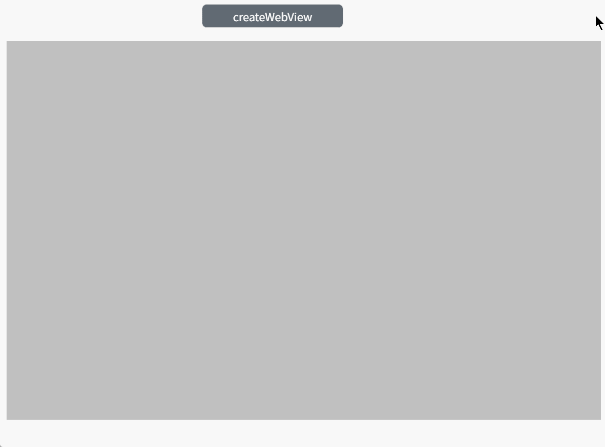

# createWebView

**Description**: Generate default style embedded pages based on the incoming src link

```typescript
const view = await System.UI.findControl('3DViewer1')// Obtain a 3D viewer control named "3DViewer1" in the page
const scene = await view.getScene();
const webView = scene.createWebView({
  name: "webView" + Math.floor(Math.random() * 101),//The name of the embedded page
  title: 'overview',//The title of the embedded page
  src: 'http://localhost:8066/#/runtime/2407d598-5f17-400e-9ea0-0d17b7098142/d4c69ed1-5d39-45c6-99a0-8a6d758bfe80?n=Overview&sharedKey=9dc92c32-d2c3-437e-b5ca-46738bbe3197' ,//The address of the embedded page
  size: {
    width: 1700,
    height: 900
  },//The width and height of the embedded page
  fixed: true,//always facing the camera
  //Parent: ThreeDlElement | null//The created parent is added directly to the scene by default
})
```
 
**Example:**

Write the above code on the button, click the button, and you can create an embedded page at the specified location





