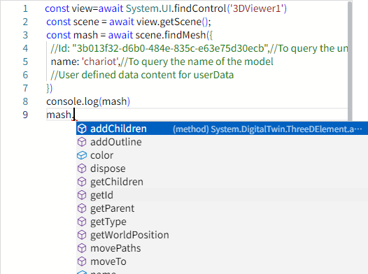

# findMesh

**Description**: Query the first model that meets the criteria in the scene

```typescript
const view = await System.UI.findControl('3DViewer1')// Obtain a 3D viewer control named "3DViewer1" in the page
const scene = await view.getScene();
const mash = await scene.findMesh({
  //Id: "3b013f32-d6b0-484e-835c-e63e75d30ecb",//To query the unique uuid of the model
  name: 'chariot',//To query the name of the model
  //User defined data content for userData
})
console.log(mash)
```
 
**Example:**

Write the above code on the button, click the button, and you can query the first matching model named chariot in the scene


The queried model can use all its methods and properties:




