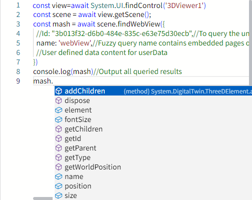

# findWebView

**Description**: The first embedded page that meets the criteria in the query scenario

Query embedded pages:

```typescript
const view = await System.UI.findControl('3DViewer1')// Obtain a 3D viewer control named "3DViewer1" in the page
const scene = await view.getScene();
const mash = await scene.findWebView({
  //Id: "3b013f32-d6b0-484e-835c-e63e75d30ecb",//To query the unique uuid of the model
  name: 'webView',//Fuzzy query name contains embedded pages of webView
  //User defined data content for userData
})
console.log(mash)//Output all queried results
```
 
**Example:**

Write the above code on the button, click the button, and you can query the first embedded page in the scene whose name includes webView


The queried model can use all its methods and properties:




