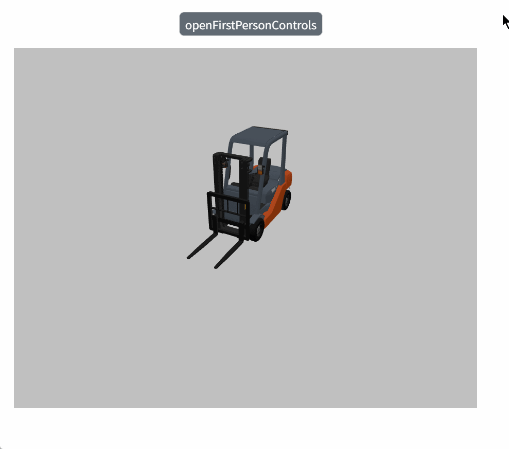

# openFirstPersonControls

**Description: Enable first person mode**(Operation method: WASD operates the forward, left, backward, and right movement of the perspective; drag the mouse to rotate the perspective; spacebar to jump; query the model and delete:)

```typescript
const view = await System.UI.findControl('3DViewer1')// Obtain a 3D viewer control named "3DViewer1" in the page
const scene = await view.getScene();
scene.openFirstPersonControls ({
  useCollision: true,//Whether to enable physical collision(default no)
  startCoordinate: {x: 20, y: 100, z: 20},//First person perspective initial position(default to current camera position)
  hight: 2.2,//Ground height(default 1.8)
  weight: 4//Gravity (default to 1 affecting jumping)
});
```
 
**Example:**

Write the above code on the button, click the button, and start falling from the initial position of the first person perspective to the specified height.

