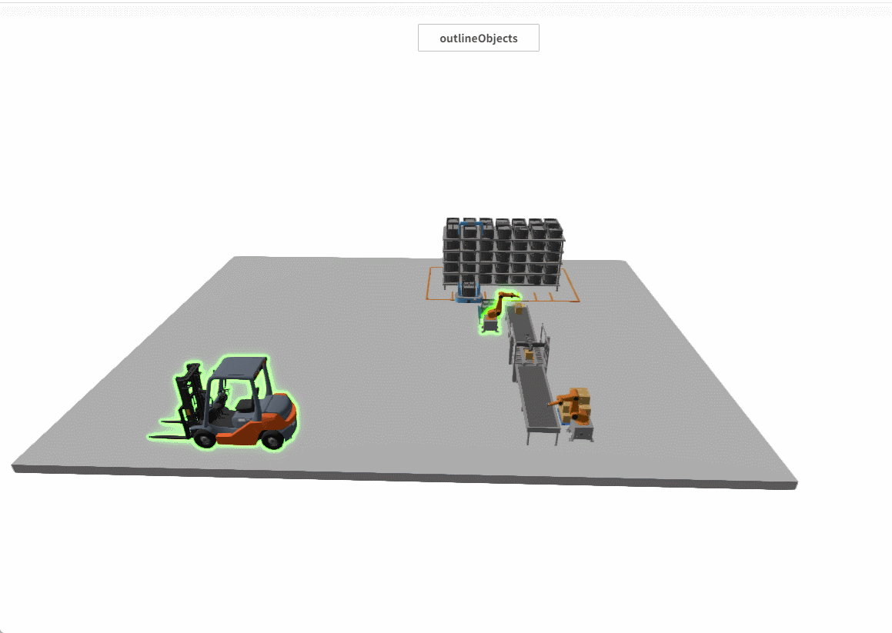

# outlineObjects

**Description:** Set up the model that requires outline.

```typescript
const view = await System.UI.findControl('3DViewer1')// Obtain a 3D viewer control named "3DViewer1" in the page
const scene = await view.getScene();
const forklift = await scene.findMesh({ name: 'Forklift' });
const roboticArm02 = await scene.findMesh({ name: 'RoboticArm_02' });
scene.outlineObjects = [roboticArm02];
```
 
**Example:**

Write the above code on a button. When the button is clicked, apply outline to the passed-in model.

