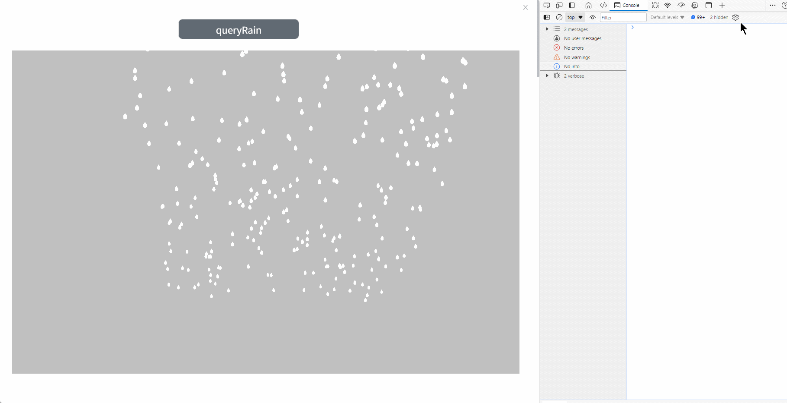

# queryRain

**Description:** Query all eligible rain effects in the scene

Query Rain:

```typescript
const view = await System.UI.findControl('3DViewer1')// Obtain a 3D viewer control named "3DViewer1" in the page
const scene = await view.getScene();
const mash = await scene.queryRain('rain')//Query special effects with names containing rain
console.log(mash)//Output all queried results
```
 
**Example:**

Write the above code on the button, click the button, and you can query the rain effect in the scene with the name including rain



The queried model can use all its methods and properties:


