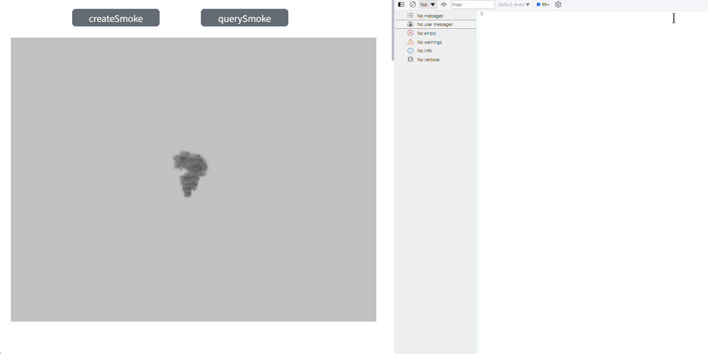

# querySmoke

**Description**: Query all eligible smoke effects in the scene

Search for smoke:

```typescript
const view = await System.UI.findControl('3DViewer1')// Obtain a 3D viewer control named "3DViewer1" in the page
const scene = await view.getScene();
const mash = await scene.querySmoke('smoke')//Query the special effects with the name containing smoke
console.log(mash)//Output all queried results
```
 
**Example:**

Write the above code on the button, click the button, and you can query the smoke effect in the scene with the name containing smoke


The queried model can use all its methods and properties:


