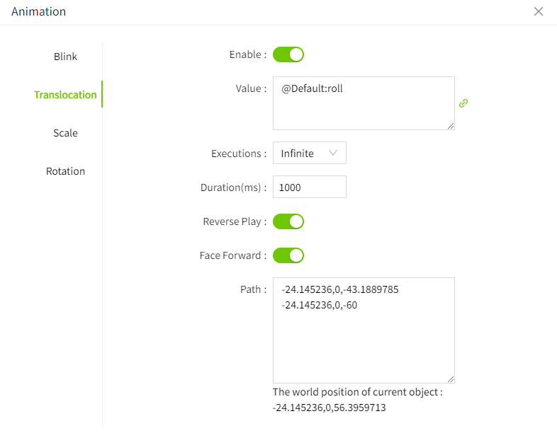
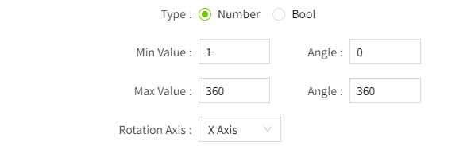
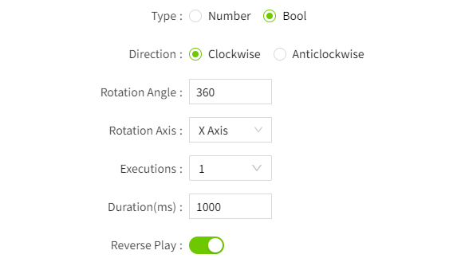

# Animation

By rationally applying animation effects, VC Hub can bring users a more efficient, intuitive and pleasant interface interaction experience.

In VC Hub, when the model has animation attributes, the "Animation" column will be displayed in the attribute bar on the right. Click the setting button to set the animation.

## **Animation type**

VC Hub's 3D models support the following animation types:

#### Blink

The blink effect is easy to attract attention and is often used to alarm when abnormal conditions occur.

**Example**

Create a sphere model that represents an alarm light that flashes when the value of Temperature is greater than 40.

| **Name**   | **Value**   |
|:------------|:--------------------------|
| Enable     | Enable      |
| Bool value | Expression: tag('Default:temperature) > 40;    **Note:** This animation only takes effect when the value is a Boolean value.  |
| Executions | The number of times to flash when the value is true        |
| Duration   | The execution time of each flash, unit ms.          |

#### Translocation

Let the model perform dynamic effects of displacement through paths.

**Example**

The model is displaced according to the path on the conveyor belt.

| **Name**                             | **Value**                                                                                                                                                                  |
|:--------------------------------------|:----------------------------------------------------------------------------------------------------------------------------------------------------------------------------|
| Enable                               | Enable                                                                                                                                                                     |
| Duration (ms)                        | The time for each displacement execution, unit ms                                                                                                                          |
| Executions                           | The number of times it needs to be executed when the value is true                                                                                                         |
| Reverse Play                         | Does the model move to the end of the path and then move back in the opposite direction?                                                                                   |
| Face Forward                         | The model always faces the direction of motion.                                                                                                                            |
| Path                                 | The path where the model needs to be displaced                                                                                                                             |
| Bool value                           | Tag: Default:roll     **Note:** This animation only takes effect when the value is a Bool value.  |
| The world position of current object | Show the world position of current object                     |

#### **Rotation**

The model rotates as the value changes.

| **Name**          | **Value**   |
|:------------------|:-------------|
| Enabled           | Enable  |
| value             | Tag: Default:Express |
| Type              | The result type of the value. Divided into Number type and Bool type.   Number type:      Bool type:   |
| Min Value         | When the type is number, this parameter is displayed. Used in combination with the "angle" . Set the min value at which the animation takes effect, and the rotation angle of the model at the min value.   |
| Max Value         | When the type is number, this parameter is displayed. Used in combination with the "angle" . Set the max value at which the animation takes effect, and the rotation angle of the model at the max value.  |
| X Axis Offset(px) | Used to set the offset distance of the rotation center point to the X-axis.   |
| Y Axis Offset(px) | Used to set the offset distance of the rotation center point to the Y axis.   |
| Z Axis Offset(px) | Used to set the offset distance of the rotation center point to the Z axis.  |
| Direction         | When the type is Bool, this parameter is displayed. Indicates the direction of rotation. |
| Rotation Angle    | When the type is Bool, this parameter is displayed. Indicates how many degrees to rotate.  |
| Executions        | When the type is Bool, this parameter is displayed. Indicates how many times it needs to be rotated.  |
| Duration(ms)      | When the type is Bool, this parameter is displayed. Indicates the duration of each spin.  |
| Reverse Play      | When the type is Bool, this parameter is displayed. Indicates whether to reversely rotate back after rotating to a specified angle.  |

#### Scale

Change the model through changes in values.

**Example**

The cube determines whether to scale based on a Bool value.

| **Name**     | **Value**                                                                                                                                                                 |
|:--------------|:---------------------------------------------------------------------------------------------------------------------------------------------------------------------------|
| Enabled      | Enable                                                                                                                                                                    |
| Bool value   | Tag: Default:roll   **Note:** This animation only takes effect when the value is a Bool value. | 
| Percentage   | The size of the deformation of the model.                                                                                                                                 |
| Direction    | In which direction the model should deform.                                                                                                                               |
| Executions   | The number of times it needs to be executed when the value is true.                                                                                                       |
| Duration     | The duration of each deformation, unit is ms.                                                                                                                             |
| Reverse Play | Indicates whether to scale back after scaling to a specified percentage.                                                                                                  |

