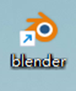

# Convert 3D Models to GLB Format

3D models can be converted to glb format by third party tools.

## Tool 1: blender

Installation address: ***[blender.org- Home of the Blender project - Free and Open 3D Creation Software](https://www.blender.org/)***

**Steps：**

1.  Use other  software to export file formats that blender can open.
2.  The most common and stable formats are **FBX** ,**OBJ** .
3.  After the export file is finished, import blender software as shown in the picture.
    
4.  Select the  imported model and perform the following operations to export the GLB file.
    

## Tool 2: online three.js editor

**FBX**  and **OBJ** files are recommended.

three.js editor address: ***[three.js editor (threejs.org)](https://threejs.org/editor/)***

**Steps：**

1.Import the file into **three.js.**

  
2.Select Export **GLB** format.

