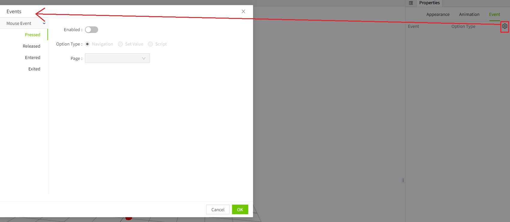
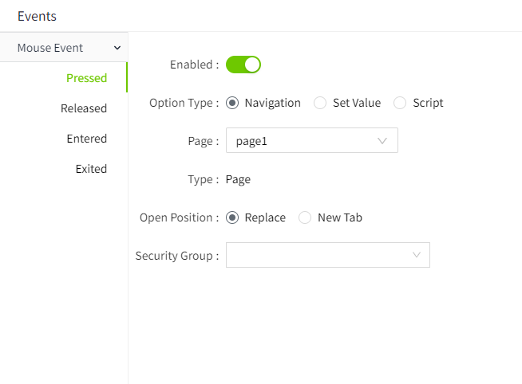
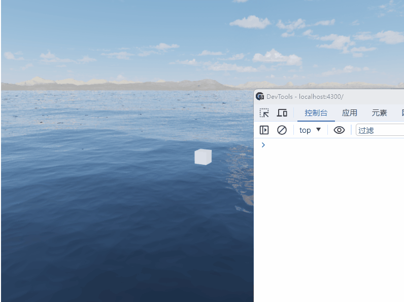

# Event

In VC Hub, when a model has event properties, the 'Event' column will be displayed in the right-hand property panel. Clicking the settings button allows for event configuration.

## **How to trigger an event**

Specific events can be triggered by the following events.

#### **Mouse Event**

Mouse events refer to triggering specific events when the user uses the mouse to operate the page or controls. Include:

- Pressed
- Released
- Entered
- Exited

## **Event type**

#### **Navigation**

Simply select a page from the page list. When the trigger condition for the event is met, the selected page will open. Different opening positions can be set for pages of different types.

**Example**

Add a cube model to the page in the scene editor. When the mouse is clicked on the model, a pop-up window will open to introduce the detailed information of the model.

#### **Set Value**

Assign a new value to the tag.

**Example**

When the mouse is clicked and the model is lifted, the value of tag 1 will be modified to 10.

#### **Script**

Allows you to write custom scripts for more flexible configuration.

**Example**

When the mouse enters the model range, a script will be executed.

#### **Security Group**

To set the required security group, click the Security Group drop-down button and select one or more roles in the expanded list. After selecting characters, they will be displayed in the selection box.

Once a security group is set for an action, when the action is triggered by running the page, a login window will pop up, requiring the user to authenticate. Only users who belong to the role of the set security group have permission to perform this event.

> **Note:** The security group is only effective when authentication is performed using a Local-type Identity Provider.