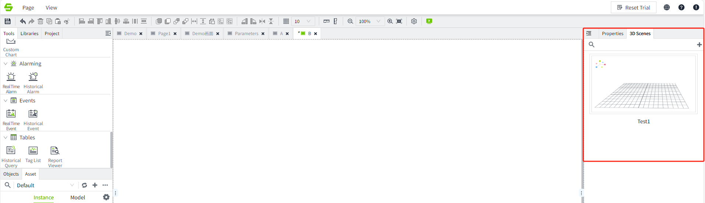
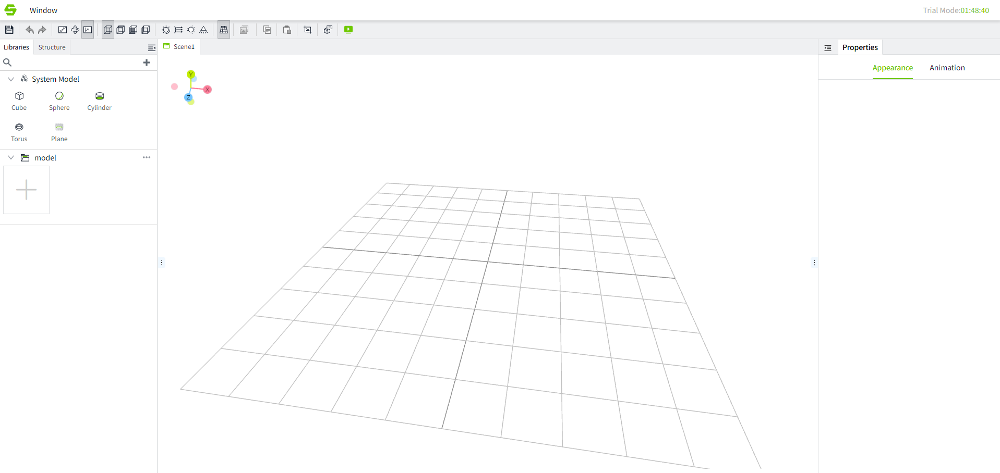

# 3D Visualization

In addition to supporting traditional 2D visualization, VC Hub also supports more powerful 3D visualization. You can create 3D visualization projects just like you create 2D visualizations. At the same time, 3D visualization also provides a more powerful and flexible low-code platform, allowing you to build a true 3D digital twin application.

Description of 3D files supported on VC Hub:

1. Only files in .glb format are supported. You can [Convert 3D Models to GLB Format](convert-3d-models-to-glb-format.md) by third party tools.
2. The size of a single model **≤** **20 MB** (models exceeding this size will not support browser caching).The total **size** of all models in a single scene should be **≤ 500 MB**, with a maximum of **3,000 models** and a **total triangle** count of **≤** **8 million**.
3. Models can be converted to glb format within 3D drawing tools, such as 3D Max, Auto CAD, etc.
4. The initial scene loading time is dependent on the network bandwidth quality. For subsequent loads, local caching is automatically utilized according to the browser's default behavior(On the condition that each single model size does not exceed 20 MB).

### **3D Model Requirements**

To ensure smooth performance of 3D models within the editor, the following requirements must be met:

1. **Remove invisible geometry**, such as internal building structures, furniture, or other non-visible components.
2. **Split large models** by material into separate parts, and combine geometries with the same material into a single mesh.
3. It is recommended to **use standard PBR** (Physically Based Rendering) materials provided by  3D Max.
4. Each material should contain no more than 5 texture maps, and each texture should not exceed 5 MB in size. The reflectivity value should be adjusted according to the physical properties of each object. If reflection is not needed, set the reflectivity to 0 and the roughness to 1.
5. After modeling is completed, **convert the model to an editable polygon**, and check for disconnected vertices or faces to ensure that the geometry is fully connected.

#### **Scene Editor**

In 3D visualization, there is no concept of page. The first thing you have to use is the 3D scene editor. The scene here can be simply understood as a picture in 2D, so the scene editor functions similar to the 2D picture editor. You can use the 3D scene editor provided by VC Hub to create 3D  scenes one after another.

#### **Model Editor**

In a 3D scene, you can use independent models to build your entire 3D scene, so VC Hub provides you with a model editor , and you can import and export the edited model to the scene for use. The 3D model is similar to the various controls you use in 2D visualization, except that these controls require you to import them from the outside, and then configure the relevant visualization before using them.

#### **3D Low Code**

Through the visualization functions provided by the scene editor and model editor, you can configure various 3D digital twin monitoring applications just like 2D visualization. But if you need to use some more advanced 3D functions, such as dynamically creating a 3D model into the scene and dynamically setting the 3D model according to some on-site real-time conditions, then VC Hub also opens a wide variety of 3D control APIs to you, and you can use these API builds richer 3D scenes. For details, you can refer to the 3D low-code example .

