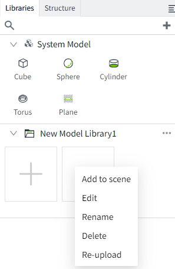
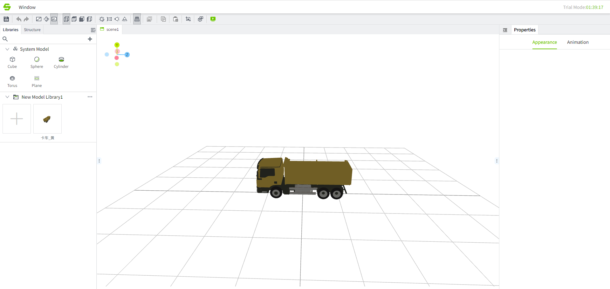
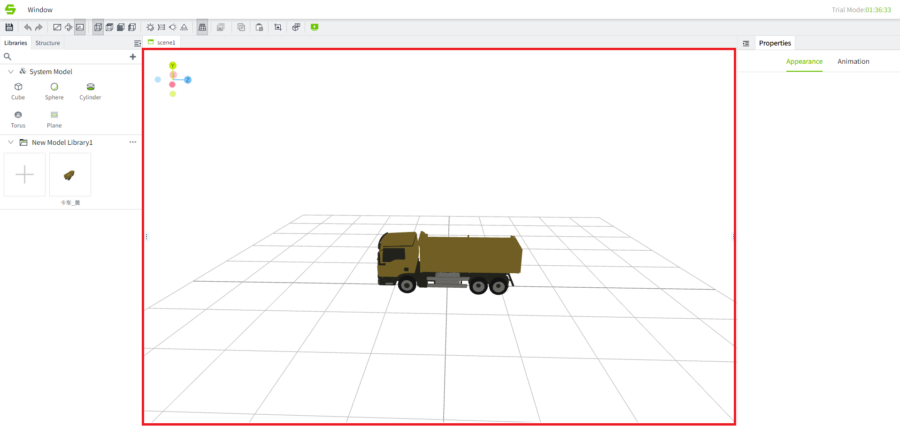
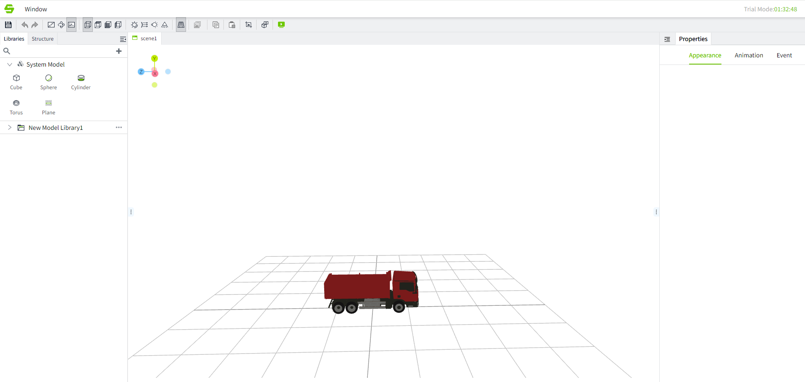

# Introduction to Model Editor

Models uploaded to the model library can be modified in the model editor. The operations of the model editor and the scene editor are the same. The scene editor is mainly responsible for operating the scene and modifying multiple models at the same time. However, the modification of the model will only take effect in the current scene, while the model modified by the model editor will not It will take effect on all models referenced by the scene. It is worth noting that if the model is modified in the editor, the modification of the model configuration in the scene editor will take precedence over the configuration in the model editor.

In the model editor, you can right-click the model through the model library in the property bar on the right side of the scene editor. Click modify to enter the model editor.

#### **Edit model**

The model is displayed in the red box area in the figure below.

The position, rotation, scaling and color of the selected model node can be edited. After editing and saving, the added models in the scene will be updated with the new configuration.

