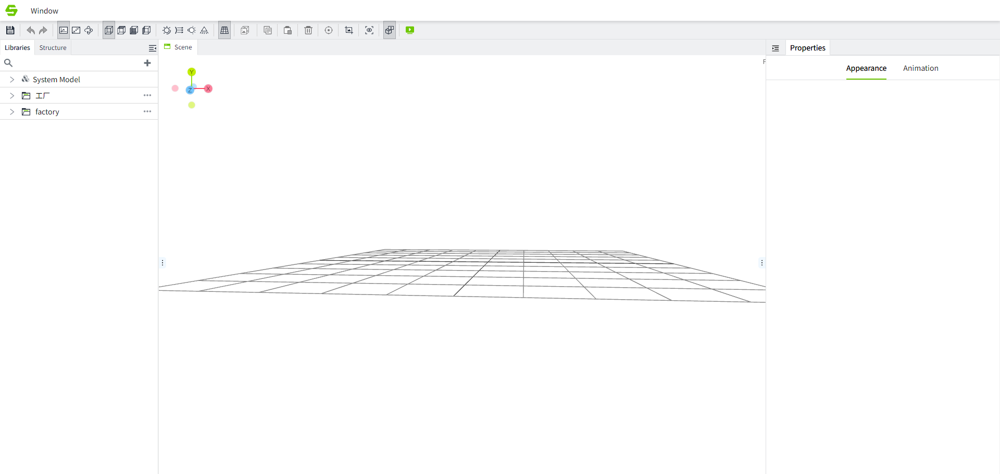
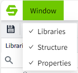
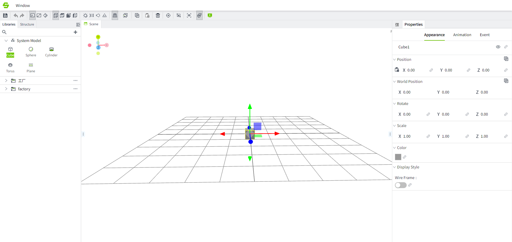

# Introduction to Scene Editor

You can add models, set model properties, set animations, events, etc. for the model in the scene editor.

## Add scene

In the  " **3D Scenes** " window, click the ➕ button in the upper right corner to add a scene.

Right-click the scene to modify, rename, export, and delete it.

Double-click the scene or click "Edit" in the right-click pop-up window to enter the scene editor.

## Toolbar

There is a toolbar at the top of the editor. When the mouse is placed on any button of the toolbar, a message box will appear to indicate the function of this button.

## Window menu

The editor comes with many windows. You can confirm the window you want to open as needed, or adjust the display position and size of the window based on your usage habits.

The window display mode shows:

Form 1:

Form two:

| **Window** | **Description**                                                                                                                                                                                                 |
|:------------|:-----------------------------------------------------------------------------------------------------------------------------------------------------------------------------------------------------------------|
| Libraries  | Used to display and manage model materials.                                                                                                                                                                     |
| Structure  | The model in the currently opened scene is displayed in a tree structure, and the status of the model (locked, hidden, animated, and action set) is displayed to facilitate users to quickly operate the model. |
| Properties | Displays the property configuration interface to facilitate model settings.                                                                                                                                     |

## Scene editor

Display and operate the model in this area.

## Preview scene

Click the "Preview" button to enter preview mode to ensure that the scene is displayed as expected.

