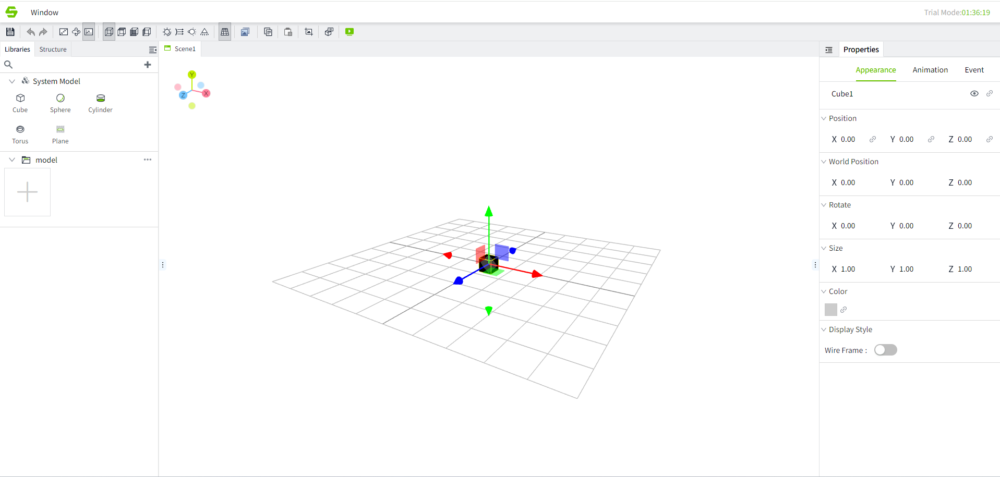
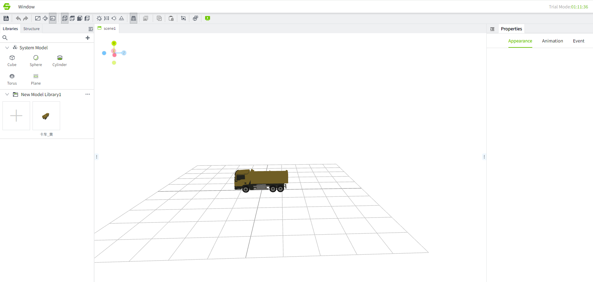
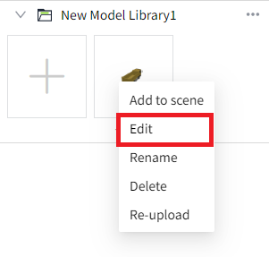
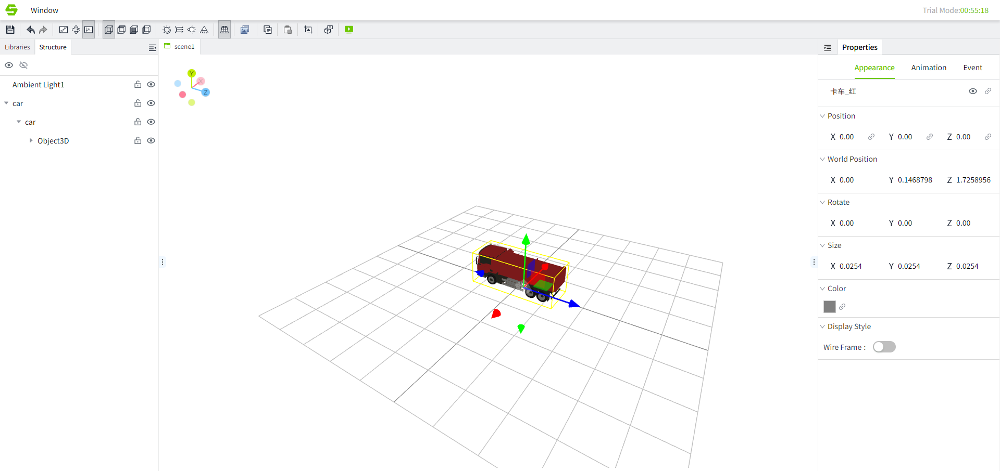
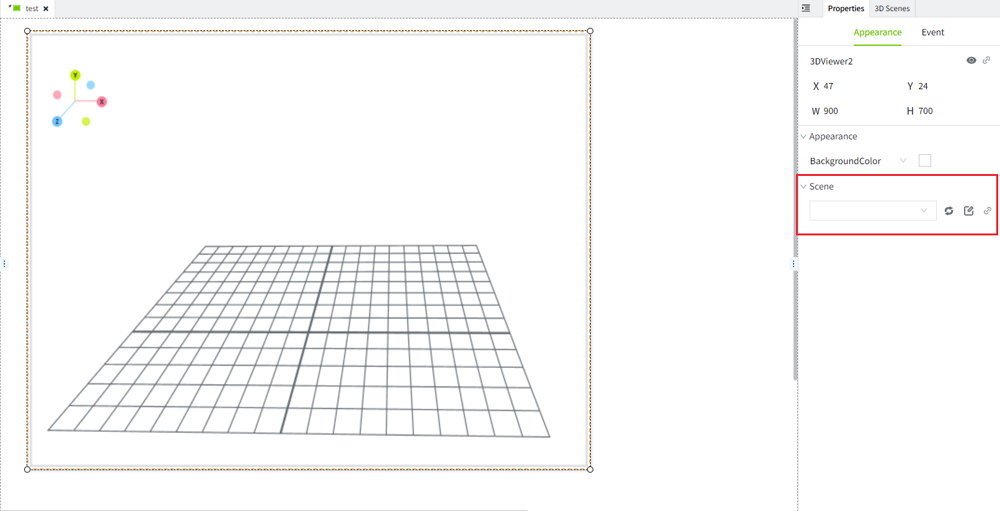

# Page Visualization

When entering the scene editor, you can see the current scene page visualization.

There are model libraries, structures, and properties in the scene visualization.

## **Model library**

The model library is divided into system model and local model library

#### **System model**

The system model library is always on top of the local model library. The built-in basic models of cube, sphere, cylinder, Torus and Plane are included.

Double-click the system model to add the model to the scene. The system model does not support editing and modification operations. It can only be added to the scene. It is added to the default position x:0, y:0,z:0 in the scene.

#### **Local model library**

You can add models according to your preferences and actual needs. After clicking "Add" in the library window, a local model library will be automatically created, and the library name will be in editing state.

You can modify the name of the model library (you can double-click the name of the model library to modify the name again later). After the modification is completed, click the Add button in the model library.

The Open dialog window will appear. Just find the model you need to upload on the local system, you can select multiple, and then click the "Open" button in the dialog box to upload the selected model.

## **Use model**

1. Upload the model to the model library.
2. Right-click the model from the model library to add it to the scene or double-click the model

    After adding the model to the scene, a pop-up window will appear to select the scaling ratio.

    

| **Name**          | **Description**                                                                                  |
|:-------------------|:--------------------------------------------------------------------------------------------------|
| No scaling        | The model will be added to the scene according to its original size                              |
| Scale to fit grid | The model will be scaled to the size of the scene's corresponding grid.                          |
| Scale to units    | There are many units in the grid and the model will be scaled to the size of the number of units |

    After adding it to the scene, you can perform appearance, animation , and action operations.

    

    You can also modify the model, and the model modification operation will enter the model editor.

    

    You can also delete and rename the model name. If the model is being edited in the model editor, renaming, deletion, and re-uploading are not allowed. Only by closing the corresponding model editor can the model be renamed, deleted, or re-uploaded.

## **Structure**

Each model has a  structure tree

After selecting the model, the structure will have a lock and hide icon. After the model is locked, the model will be prohibited from editing. After hiding, the model will not be visible at any time.

##  **Appearance**

The appearance shows the basic information of the currently selected model, and the basic information can be edited.

## **Run**

After the model is added to the scene, you can go to the 2D screen and add the "3D Viewer" control to run the scene.

After adding the 3D viewer control, you need to select the scene

Now you can run the screen and see your scene.

