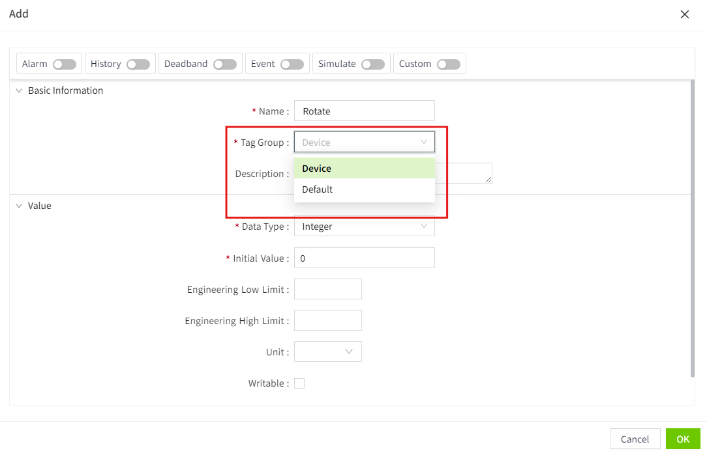

# System.Tag.subscribe


## Description

Subscribing to a tag will retrieve its value, path, quality, and time when the tag changes.
## Grammar
System.Tag.subscribe(paths: Array<string>, callback: (value: {
  
Time: string;
  
Path: string;
    
Value: any;
    
Quality: number;

}=>void): () => void

Parameter

paths - Tag paths 

callback - A callback function used to handle notifications of changes in tag values 

Return

Unsubscription function
## Code Example                                                                                                                                                                                                                                                                                                          
First create a tag group and select the refresh type of the tag group as "Value Change".


Then create a tag and check the tag group you just created.


Finally, when you subscribe to the "Device: Rotate" tag, you will receive the pushed data and print out the new value when the tag changes.
```typescript 
const unsubscript = System.Tag.subscribe(['@Device: Rotate'], (value) => {
    console.log('subscribe', value.Value);
});

// Unsubscribe after 60 seconds
setTimeout(() => {
    unsubscript();
}, 1000 * 60);


``` 
    Note: If the “Refresh Type“ of the tag group is set to “Periodical“, the tag values will be retrieved according to the frequency of the selected period after subscribing to the tags.
