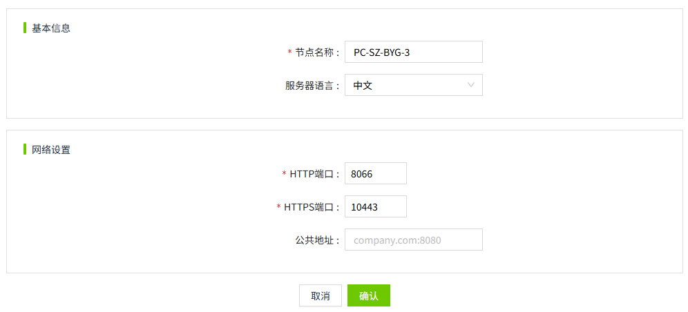
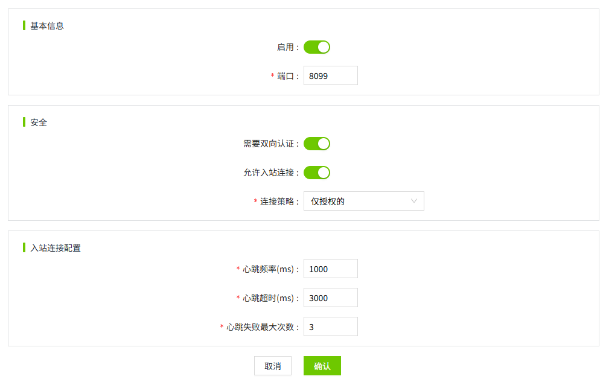
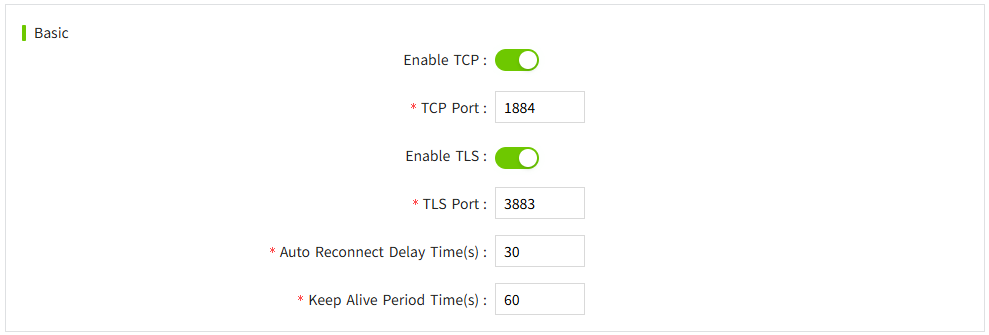
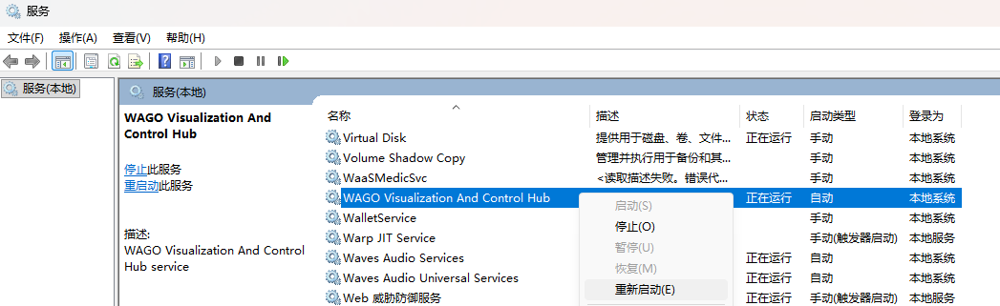

# Installation and Upgrade

## **Installation Environment**

VC Hub provides installation packages for both Windows and Linux environments. VC Hub does not support container deployment. Do not run it in a container.

If an old version is already installed in the installation environment, please uninstall it first. VC Hub does not support upgrade installation. You must uninstall the installed version before each new installation.

***Note:*** ***Please close all local anti-virus software before installation.*** ***Because some antivirus software may mistakenly identify the installation files as viruses.***

## **Ports**

The installation program defaults to using port 8066 for HTTP and port 10443 for HTTPS. Please ensure that port 8066 is available during installation. 

| **Port** | **Description**                       | **Configuration**                       |
|----------|---------------------------------------|-----------------------------------------|
| 8066     | HTTP default port                     | **"Node">"Node Settings">"Web Server"** |
| 10443    | HTTPS default port                    | **"Node">"Node Settings">"Web Server"** |
| 8099     | Networking default port               | **"Node">"Networking">"Main"**          |
| 1883     | Built-in Mqtt Broker default TCP port | **"Node">"MQTT Broker">"Basic"**        |
| 8883     | Built-in Mqtt Broker default TLS port | **"Node">"MQTT Broker">"Basic"**        |

**The http and https ports are configured as follows:**

**The networking port is configured as follows:**

**The Mqtt port is configured as follows:**

## **Version**

VC Hub uses a version structure: "Major Version. Minor Version. Revision Version". The project data version must match the version of the running program to operate.

## **Uninstallation**

The user data directory and the installation program directory are independent. Uninstalling will not delete user data. If necessary, you can manually delete the user data directory.

## **Upgrade**

Within the maintenance period, you can upgrade to the VC Hub installation package released during the maintenance period for free.

If the maintenance has expired and has not been renewed, you can upgrade to the revision version for free. As long as the "Major Version. Minor Version" matches the current authorized version, there are no restrictions on upgrading.

Direct upgrade installation is not currently supported. Before upgrading, please uninstall first. After uninstalling, install the new version.

## **System Environment Tags**

| **Tag Name**                               | **Description**        | **Windows Environment DefaultValue** | **Linux Environment DefaultValue** | **Usage Instructions**      |
|--------------------------------------------|------------------------|--------------------------------------|----------------------------------- |-----------------------------|
| WAGO_Visualization_And _Control_Hub_APP     | Installation directory | C:\Program Files\WAGO Visualization And Control Hub | /usr/local/bin      | Used only to record the application directory, do not modify.                                                                                                                                                                                            |
| WAGO_Visualization_And _Control_Hub_DATA    | Data directory         | C:\ProgramData\WAGO VisualizationAndControlHub| /usr/share/wagovisualization andcontrolhub | Used to configure the VC Hub application data directory.  If not configured, the default value is used.   If you want to change the application directory, you can modify this tag value and restart the application for the configuration to take effect. |
| WAGO_Visualization_And _Control_Hub_Version | Version                | Installation program version         | Installation program version       | Used only to record the application version, do not modify.                                                                                                                                                                                              |

## **User Data Directory**

Windows installation environment user data directory: "%ProgramData%\WAGOVisualizationAndControlHub", usually "C:\ProgramData\WAGOVisualizationAndControlHub".

Linux installation environment user data directory: /usr/share/wagovisualizationandcontrolhub

## **Restart Service**

**Windows environment**: Restart the VC Hub service in the system services.

**Linux environment**: `sudo systemctl restart virtualiztionandcontrolhub`

And you can also stop the service first: `sudo systemctl stop virtualiztionandcontrolhub` and then start the service: `sudo systemctl start virtualiztionandcontrolhub`
