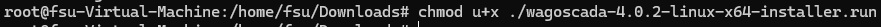
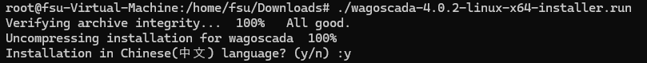
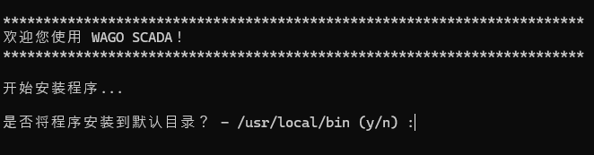
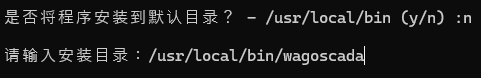
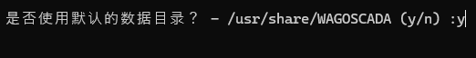
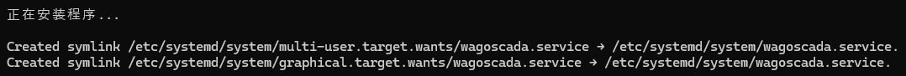
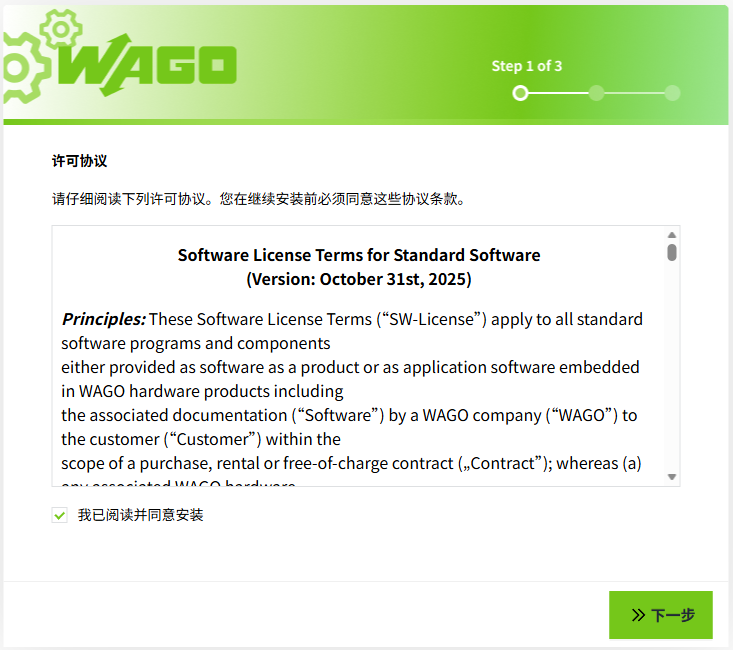
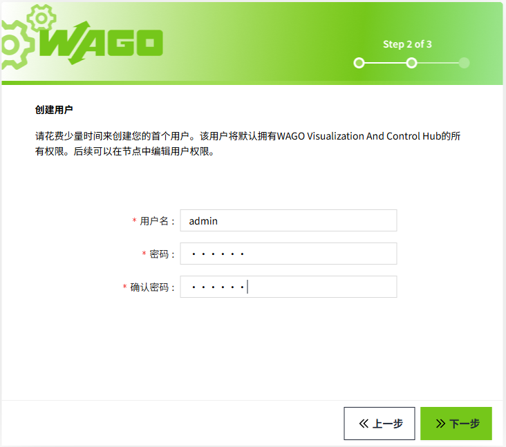
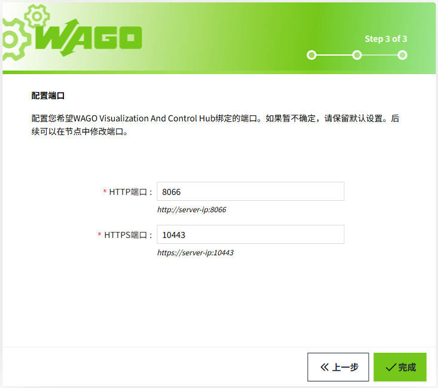

# Linux Environment

VC Hub provides an installation package for the Linux environment, with the file name wagovisualizationandcontrolhub-x.x.x-linux-x64-installer.run.

## **Installation Steps:**

1. Copy the installation package to a directory on the Linux server.
2. Grant the file owner the permission to execute the installation file 




3. Run the installation package in the directory using the command ./ followed by the file name. 


4. Select the installation language.




5. Customize the installation directory or use the default directory. If the installation directory does not exist, the installer will create it automatically.







6. Customize the data directory or use the default directory.




7. Wait for the installation to complete. This process may take some time, so please be patient. 




8. The installation is complete.


9. After completion, the default access to the VC Hub site is: `http://localhost:8066`. After the installation, you will enter the configuration wizard interface.

**Notes:** 

1. The program is supervised and managed by the systemd service manager that comes with the Linux system. Ensure that the systemd on the server is running properly.
2. The installation script includes operations such as creating scripts, so make sure you have sufficient permissions.

## Configuration:

1. Read and agree the license agreement

2. Create an administrator user. Remember this username and password, as you will use them to log in for the first time. 

   


3. Port configuration, configure HTTP, HTTPS ports, and remember the access port. 

   


4. After completing the above steps, wait for the program to load, and then you can log in to the default workspace with the administrator user created in step 2.

**Note**: If you perform an upgrade installation, a new empty workspace will be created by default. To return to the original workspace, you need to log in to the new workspace first and then manually open the original workspace from the workspace list. 


## Security Configuration (Optional)

To further enhance system security, it is recommended to perform the following steps after configuration to set permissions on the **service directory and application data directory**, allowing only specific users to access or modify them. This ensures that sensitive data is well protected and potential risks are minimized.

1.  Create a Dedicated Service Account

    Create a dedicated system account (e.g., wago_vc_hub) with no interactive login, used only to run service processes:

```
sudo useradd -r -s /sbin/nologin wago_vc_hub
```
 
Then, configure passwordless sudo for this account via the sudoers file:

```Plain Text
wago_vc_hub ALL=(ALL) NOPASSWD: ALL
```
 
2. Set Service Installation Directory Permissions

    Assign ownership of the service installation directory (e.g., /usr/local/bin/wagovisualizationandcontrolhub-x.x.x-linux-x64) to wago_vc_hub and restrict access to other users:

```Plain Text
sudo chown -R wago_vc_hub:wago_vc_hub /usr/local/bin/wagovisualizationandcontrolhub-x.x.x-linux-x64
sudo chmod -R 750 /usr/local/bin/wagovisualizationandcontrolhub-x.x.x-linux-x64
```
 
   **Note:** Perform this step before changing the service run account, otherwise the service may lose access.

3. Modify Service Run Account

  Configure the service to run under the wago_vc_hub account:

```Plain Text
sudo systemctl edit visualizationandcontrolhub.service
```
 
Add the following lines under the [Service] section:

```Plain Text
User=wago_vc_hub
Group=wago_vc_hub
```
 
Then reload the systemd configuration and restart the service:

```Plain Text
sudo systemctl daemon-reexec
sudo systemctl restart visualizationandcontrolhub.service
```
 
4. Set Application Data Directory Permissions

    Assign ownership of the data directory (e.g., /usr/share/wagovisualizationandcontrolhub) to wago_vc_hub and ensure read/write access while restricting other users:

```Plain Text
sudo chown -R wago_vc_hub:wago_vc_hub /usr/share/wagovisualizationandcontrolhub
sudo chmod -R 750 /usr/share/wagovisualizationandcontrolhub
```
 
5. Verify Configuration

   Check that the service is running under the wago_vc_hub account and confirm the site is accessible:

```Plain Text
systemctl status visualizationandcontrolhub.service
```
 
  Open a browser and visit the VC Hub site (e.g., `http://localhost:8066`) to verify it is running correctly.

## **Uninstallation Steps:**

1. Go to the parent directory of the installation directory.
2. Grant the file owner the permission to execute the file "visualizationandcontrolhub-uninstall.sh"

   


3. Run the script "visualizationandcontrolhub-uninstall.sh".

   


4. After these operations, all program-related files will be removed, and the process supervisory service will also be removed.

**Notes:**

The uninstallation script includes operations such as deleting files, so ensure you have sufficient permissions.

