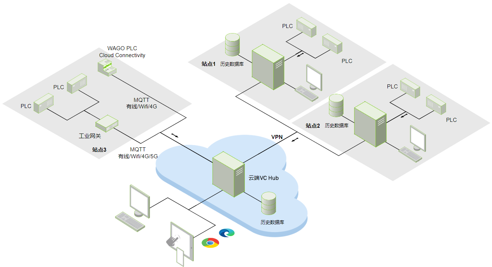

# 典型架构选型指南

#### 单服务器架构

| 所需授权模块 | 数量 |
|:--------------|:------|
| 基础平台     | 1    |
| 2D可视化     | 1    |

#### 单服务器冗余架构

| 所需授权模块      | 数量 |
|:-------------------|:------|
| 基础平台 （含冗余） | 1x2  |
| 2D可视化（含冗余）  | 1x2  |

#### 单服务器+数据库架构

| 所需授权模块 | 数量 |
|:--------------|:------|
| 基础平台     | 1    |
| 2D可视化     | 1    |
| 数据库连接   | 1    |

#### 基础组网架构

| 所需授权模块             | 数量 |
|:--------------------------|:------|
| 产线1 VC Hub - 基础平台  | 1    |
| 产线1 VC Hub- 数据库连接 | 1    |
| 产线2 VC Hub- 基础平台   | 1    |
| 产线2 VC Hub- 数据库连接 | 1    |
| 厂级VC Hub - 基础平台    | 1    |
| 厂级VC Hub - 2D可视化    | 1    |

#### 高可用组网架构

| 所需授权模块                     | 数量 |
|:----------------------------------|:------|
| 产线1 VC Hub - 基础平台（含冗余）  | 1x2  |
| 产线1 VC Hub- 数据库连接（含冗余） | 1x2  |
| 产线1 VC Hub- 2D可视化（含冗余）   | 1x2  |
| 产线2 VC Hub - 基础平台（含冗余）  | 1x2  |
| 产线2 VC Hub- 数据库连接（含冗余） | 1x2  |
| 产线2 VC Hub- 2D可视化（含冗余）   | 1x2  |
| 厂级VC Hub - 基础平台（含冗余）    | 1x2  |
| 厂级VC Hub - 2D可视化（含冗余）    | 1x2  |

#### 云边组网架构

| 所需授权模块             | 数量 |
|:--------------------------|:------|
| 站点1 VC Hub - 基础平台  | 1    |
| 站点1 VC Hub- 数据库连接 | 1    |
| 站点1 VC Hub- 2D可视化   | 1    |
| 站点2 VC Hub - 基础平台  | 1    |
| 站点2 VC Hub- 数据库连接 | 1    |
| 站点2 VC Hub- 2D可视化   | 1    |
| 云端 VC Hub - 基础平台   | 1    |
| 云端 VC Hub- 数据库连接  | 1    |
| 云端 VC Hub- 2D可视化    | 1    |

