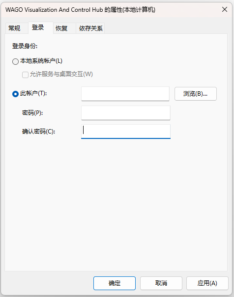
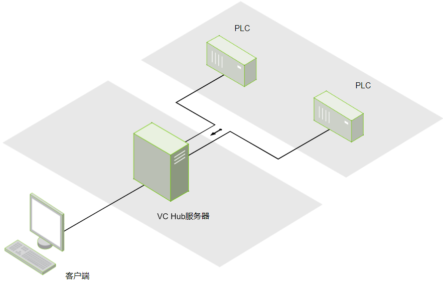
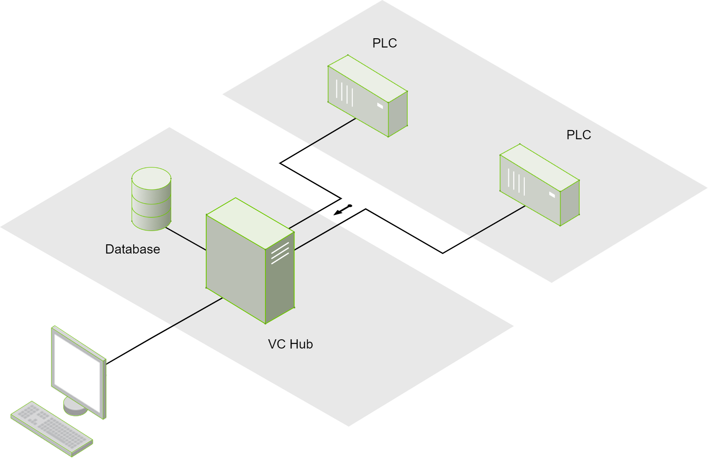
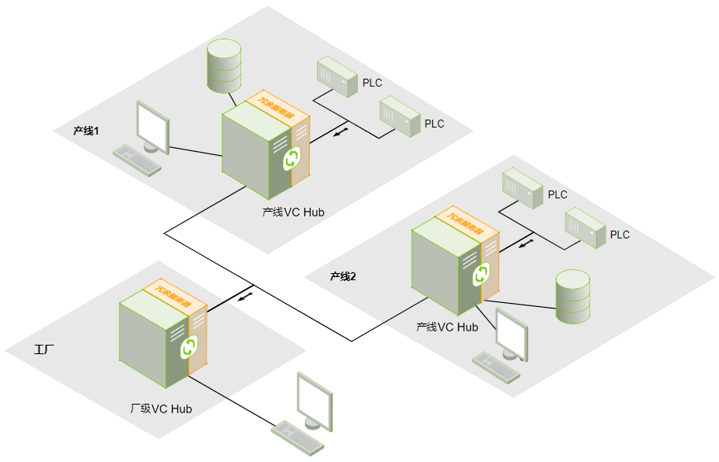

# Typical Architecture Selection Guide

## Single Server Architecture

| Required Authorized Modules | License Quantity |
|-----------------------------|------------------|
| I/O Tags                    | 1                |

## Single Server Redundant Architecture

| Required Authorized Modules | License Quantity |
|-----------------------------|------------------|
| I/O Tags                    | 2                |

## Single Server + Database Architecture

| Required Authorized Modules | License Quantity |
|-----------------------------|------------------|
| I/O Tags                    | 1                |
| Historical Data             | 1                |

## Basic Networking Architecture

| Required Authorized Modules | License Quantity |
|-----------------------------|------------------|
| Line 1 - I/O Tags           | 1                |
| Line 1 - Historical Data    | 1                |
| Line 2 - I/O Tags           | 1                |
| Line 2 - Historical Data    | 1                |
| Plant - I/O Tags            | 1                |

## High Availability Networking Architecture

| Required Authorized Modules | License Quantity |
|-----------------------------|------------------|
| Line 1 - I/O Tags           | 2                |
| Line 1 - Historical Data    | 2                |
| Line 2 - I/O Tags           | 2                |
| Line 2 - Historical Data    | 2                |
| Plant - I/O Tags            | 2                |

## Cloud-Edge Networking Architecture

| Required Authorized Modules | License Quantity |
|-----------------------------|------------------|
| Site 1 - I/O Tags           | 1                |
| Site 1  - Historical Data   | 1                |
| Site 2  - I/O Tags          | 1                |
| Site 2  - Historical Data   | 1                |
| Cloud  - I/O Tags           | 1                |
| Cloud - Historical Data     | 1                |