# Windows环境

WAGO VC Hub 提供Windows 64位操作系统安装包。

推荐在以下系统上进行安装：

- Windows Server 2012 R2
- Windows Server2016
- Windows Server 2019
- Windows Server 2022
- Windows 10 （不支持家庭版）
- Windows11（不支持家庭版）

#### 安装步骤

1. 以管理员方式运行安装包程序
2. 选择安装语言

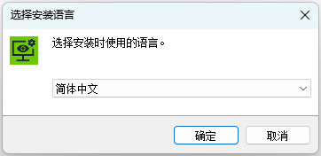

3. 进行端口检查，如果端口被占用，将无法继续进行安装

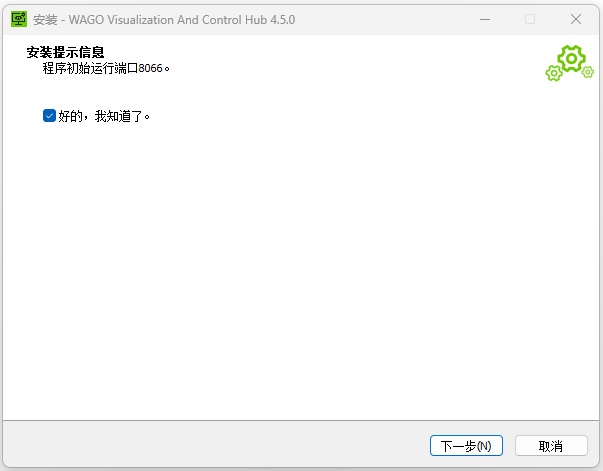

4. 阅读并同意许可协议

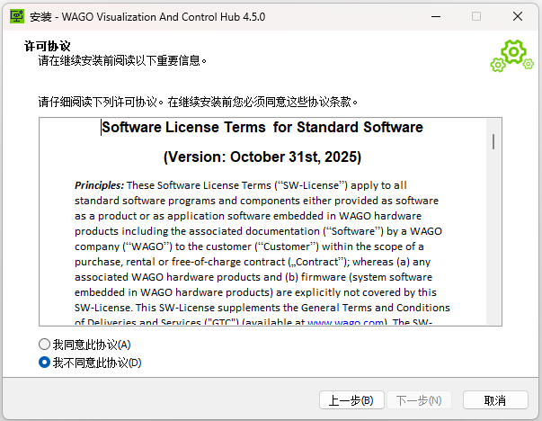

5. 选择安装位置，默认路径：“C:\Program Files\WAGO VC Hub”

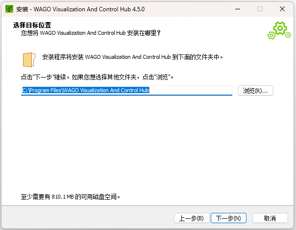

6. 选择 WAGO VC Hub 应用程序数据目录

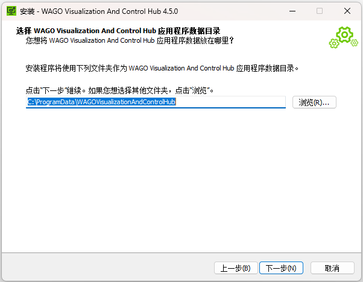

7. 准备安装

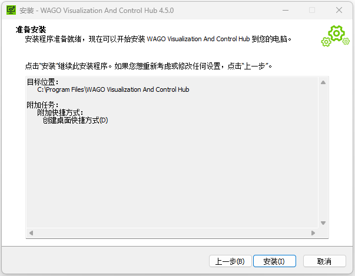

8. 安装完成

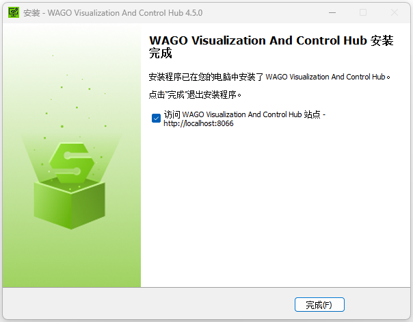

9. 完成后默认访问WAGO VC Hub站点：“http://localhost:8066”，安装完成后，将进入配置引导界面。

#### 配置步骤

1. 创建管理员用户，请牢记此用户名和密码，接下来将使用此用户名和密码进行首次登录。

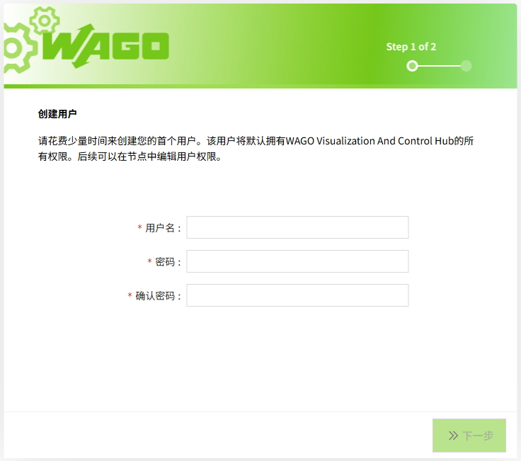

2. 端口配置，配置 HTTP, HTTPS 端口，请牢记访问端口。

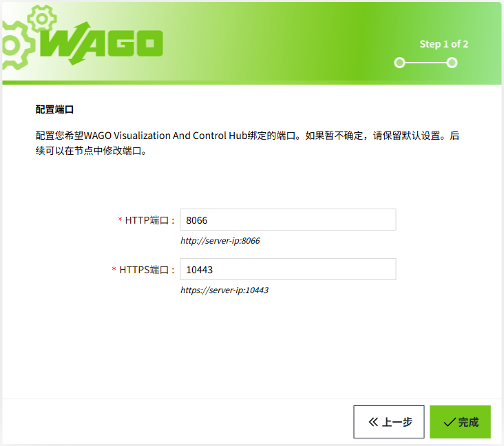

3. 上述步骤完成后，等待程序加载完毕即可用步骤1中创建的管理员用户登录默认工程。

| **说明**：每次安装后会默认创建一个新的空的工程，要想回到原工程，需要登录新工程后，在工程列表中手动打开原工程。 |
|-----------------------------------------------------------------------------------------------------------|

#### 安全配置（可选）

为进一步提升系统安全性，建议在配置完成后执行以下步骤，对**服务目录**及**应用程序数据目录**进行权限设置，只有特定的用户才能对其进行操作，以确保敏感数据受到有效保护并避免潜在风险。

1. 创建专用服务账号

       在Windows本地用户和组中新建一个账号（如 WagoVC HubSvc）：

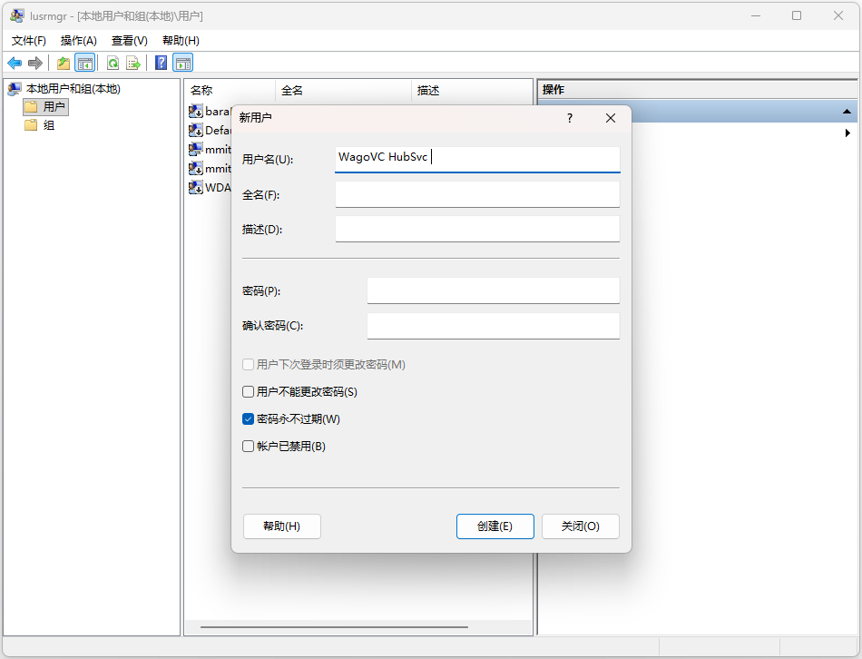

2. 设置**服务安装目录**权限

进入服务安装目录（例如 C:\Program Files\WAGO VC Hub），点击鼠标右键，选择“属性“ → “安全“

   - 根据实际安全需求选择保留的用户或组，删除不必要的用户或组（如 Users、Everyone）。
   - 添加 WagoVC HubSvc 用户，并为其赋予读取、写入、修改权限。
   - 确认应用到子文件夹和文件。
            注意：必须在修改服务运行账号之前完成此步骤，否则服务可能无法启动或重启。

3. 修改服务运行账号

      在服务管理器（services.msc）中找到 WAGO VC Hub服务 → 右键菜单中点击"属性" →"登录" → 选择“此账户”：

   - 填入 .\WagoVC HubSvc 及密码。
   - 保存并重启服务。
4. 设置**应用程序数据目录**权限

      进入安装时选择的应用程序数据目录（例如 C:\ProgramData\WAGOVC Hub），右键菜单中点击"属性"  → "安全"：

   - 根据实际安全需求选择保留的用户或组，删除不必要的用户或组（如 Users、Everyone）。
   - 添加 WagoVC HubSvc 用户，赋予读取、写入、修改权限。
   - 确认应用到子文件夹和文件。
5. 验证配置

      访问 WAGO VC Hub 站点（例如 http://localhost:8066），确认站点正常运行。

#### 卸载步骤

1. 从控制面板进入软件卸载列表，找到WAGO VC Hub进行卸载。

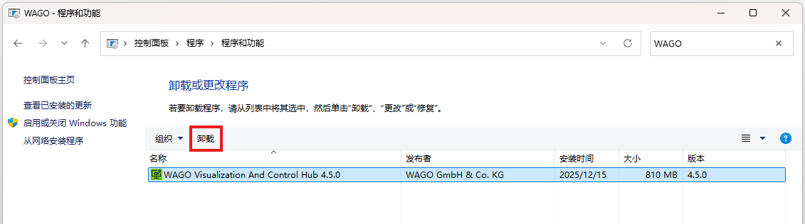

2. 确认卸载将完成应用程序卸载。

