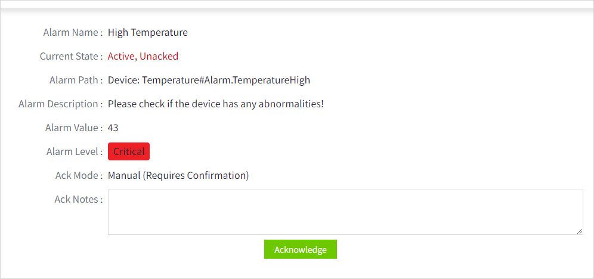

# Acknowledge Alarm

When a user receives an email or SMS containing an alarm acknowledgement link (which is configured as a parameter item in the notification message), the user can acknowledge the alarm by clicking on the link. After clicking the link in the email or SMS, the user acknowledges the alarm on the acknowledgement page.

## Acked an Alarm via Email

1. When you receive an alarm notification e-mail from the system, open the email to view the details.
    
2. After clicking the confirmation link, a new window will open displaying detailed data related to the alarm. If you need to confirm the alarm (as shown in the example below), please enter the necessary confirmation information on the page to process and record the alarm.
    
3. Fill out the form and click the “Acknowledge” button to complete the alarm acknowledgement.

## Acked an Alarm by SMS 

1. When you receive an alarm message , open the message to view the details.
    
2. Clicking the link in the SMS will open the alarm confirmation page in the browser. If confirmation of the alarm is required, please fill in the necessary confirmation information on the page (as shown in the image below).
    
3. Fill out the form and click the “Acknowledge” button to complete the alarm acknowledgement.

