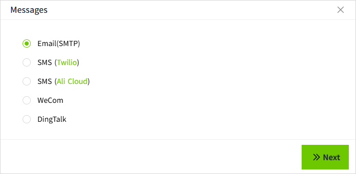

# Messages

You can set different notification content for different notification services.

Supports the following five types of content settings:

1. Email(SMTP)
2. SMS(Twilio)
3. SMS(Ali Cloud)
4. WeCom
5. DingTalk

When an alarm is triggered, users will receive the alarm notification.