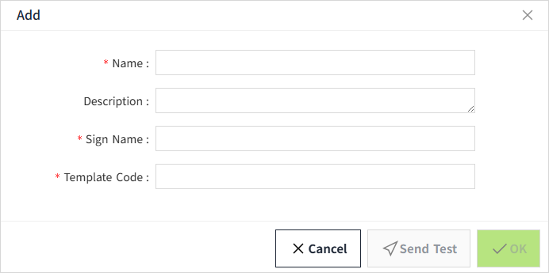
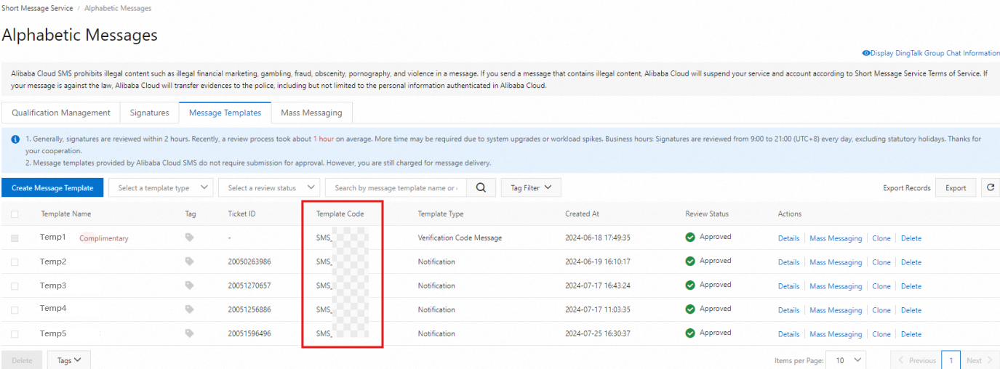

# SMS(Ali Cloud)

This configuration is used to define what is included in the SMS notification sent via Ali Cloud when an alarm is triggered.

## Create Notification Content SMS(Ali Cloud)

1. Click "**Alarming**"->" **Alarm Notifications** "->" **Messages**" to enter the notification message list page.

2. Click the "**Add**" button. In the new pop-up window, select "SMS(Ali Cloud)".

3. Click "Next" to enter the detailed configuration window. 

4. Once the setup is complete, click **"Send Test"** to check if the sms is sent successfully.
5. If the test is successful, click the **"OK"** button to add the data.

**Properties**

| **Name**      | **Description**              |
|---------------|-------------------------------|
| Name          | The name of the notification message is required. The name is unique and cannot be repeated.- |
| Description   | The subject of the email received. -|
| Sign Name     | The signature name successfully applied for in the Ali Cloud SMS service.   |
| Template Code | The template code successfully applied for in Ali Cloud SMS Template Code.   |
| Send Test     | After the above configuration, click the 'Send Test' button and a new window will pop up. Enter the mobile phone number for receiving the test SMS in the new window, select the SMS service that has been created, and click the 'Send' button to check whether the SMS can be received correctly.|

## How to use the Ali Cloud Notification Service

In the alarm notification rules, you will select the notification service.

1. Click on **"Alarming" -> "Alarm Notifications" -> "Rules"** to enter the notification rules list page.
2. Click the **"New"** button in the upper right corner of the list.
3. In the pop-up window, click the **'+SMS'** button to add a new sms notification rule.In the notification message dropdown, select the previously created notification message.

**Note:** Notification content and notification service must match. For example, when you select the notification **service** for SMS(Ali Cloud), you should also select SMS(Ali Cloud) as the notification **message**. 

