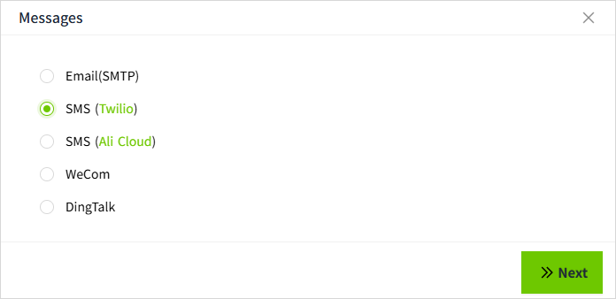
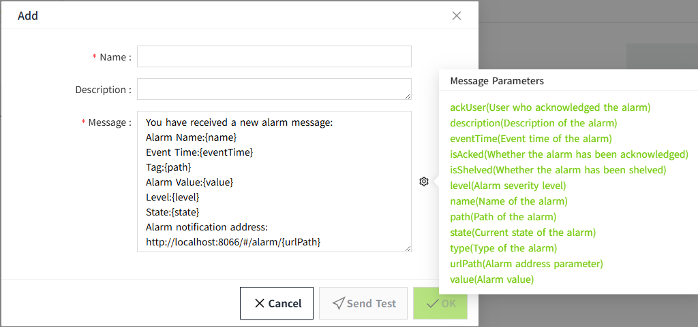

# SMS(Twilio)

This configuration is used to define the content of SMS notifications sent via Twilio when an alarm is triggered. By customizing the SMS message, you can ensure that recipients quickly understand and respond to the alarm information.

## Create Notification Content SMS(Twilio)

1. Click "**Alarming**"->"**Alarm Notifications** "->" **Messages**" to enter the notification message list page.

2. Click the "**Add**" button. In the new pop-up window, select "SMS(Twilio)".

3. Click "Next" to enter the detailed configuration window. 

4. Once the setup is complete, click **"Send Test"** to check if the sms is sent successfully.
5. If the test is successful, click the **"OK"** button to add the data.

**Properties**

| **Name**    | **Description**  |
|-------------|-------------------|
| Name        | The name of the notification message is required. The name is unique and cannot be repeated.|
| Description | The subject of the email received.|
| message     | The content received in the sms is configured through the content settings button.   Clicking this button will bring up a content parameter dialog. The parameters set here will be replaced with actual values when an alarm occurs. To insert a parameter into the content, click in the content window to place the cursor, then click the parameter settings button. From the parameter list, select the desired parameter by clicking on it, and it will be automatically inserted at the cursor's position.   **Message Parameters**       **Note:** **urlPath (alarm address parameter)** is used to construct the URL for the alarm information, which consists of the server address, port number, and the specific page path. The detailed explanation is as follows:   1. **Server address and port number:** `http://localhost:4300` This means that the request will be sent to a server named "**localhost**" and accessed via port number "**4300**". When adding a new entry, the current server address and port will be automatically retrieved.  2. **Page path:** `/#/alarm/` This path is fixed and points to the alarm confirmation page.  3. **Specific path:** `{urlPath}` This is a placeholder representing the specific alarm parameter path. When receiving an actual message, this placeholder will be replaced with the real alarm parameters. |
| Send Test   | After the above configuration, click the 'Send Test' button and a new window will pop up. Enter the mobile phone number for receiving the test SMS in the new window, select the SMS service that has been created, and click the 'Send' button to check whether the SMS can be received correctly.   |

## How to use the Twilio Notification Service

In the alarm notification rules, you will select the notification service.

1. Click on **"Alarming" -> "Alarm Notifications" -> "Rules"** to enter the notification rules list page.
2. Click the **"New"** button in the upper right corner of the list.
3. In the pop-up window, click the **'+SMS'** button to add a new sms notification rule.In the notification message dropdown, select the previously created notification message.

**Note:** Notification content and notification service must match. For example, when you select the notification **service** for SMS(Twilio), you should also select SMS(Twilio) as the notification **message**. 

